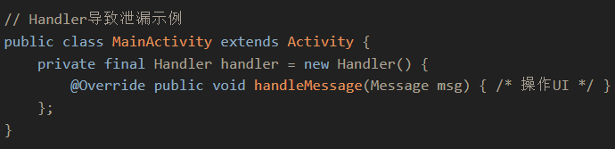

> 内存块未释放导致资源持续浪费

内存泄漏的结局就是内存溢出（程序申请内存空间不足抛OOM错误）

1. 堆溢出（创建对象过多）
2. 栈溢出（递归层数过多）
3. [方法区](方法区.md)溢出（反射、加载类过多）

# 解决方法-弱引用

> 当对象仅被弱引用指向时，垃圾回收器可以随时回收该对象

## 缓存（最常见）

```java
// WeakHashMap - 当key无强引用时自动移除
WeakHashMap<Key, Value> cache = new WeakHashMap<>();
cache.put(key, expensiveData);
// key被置空后，entry会被GC自动清理
```

## 监听器/回调（避免内存泄漏）

```java
// 弱引用持有监听器，不阻止其被回收
WeakReference<Listener> weakListener = new WeakReference<>(listener);
if (weakListener.get() != null) {
    weakListener.get().onEvent();
}
```

监听器内存泄漏的场景：

```java
// 事件源（如按钮、消息总线）
class EventBus {
    private List<Listener> listeners = new ArrayList<>(); // 强引用
    
    public void register(Listener listener) {
        listeners.add(listener);
    }
}
// 使用方
class MyActivity {
    private Listener listener = new MyListener();
    
    void onCreate() {
        eventBus.register(listener);
    }
    
    void onDestroy() {
		// 忘记调用 eventBus.unregister(listener);
		// ⚠️ listener 被 EventBus 强引用，无法回收
		// new MyListener() 也无法回收（listener持有new MyListener()强引用）
    }
}
```

解决方案：

```java
class EventBus {
    private List<WeakReference<Listener>> listeners = new ArrayList<>();
    
    public void register(Listener listener) {
        listeners.add(new WeakReference<>(listener));
    }
    
    public void post(Event event) {
        listeners.removeIf(ref -> ref.get() == null); // 清理已回收的
        for (WeakReference<Listener> ref : listeners) {
            Listener l = ref.get();
            if (l != null) l.onEvent(event);
        }
    }
}
```

1. private Listener listener = new MyListener(); - 这里 listener 是一个强引用，指向 new MyListener() 创建的对象
2. eventBus.register(listener) - 把这个 listener 添加到了 EventBus 的 `List<Listener>` 中，这个 List 也持有了一个强引用
3. 当 Activity 销毁时：
	- Activity 中的 listener 字段会被销毁（这个强引用消失）
	- 但是 EventBus 的 `List<Listener>` 中还持有对这个 MyListener 对象的强引用
	- 所以 MyListener 对象无法被回收
	- 而 MyListener 可能持有 Activity 的引用（比如[内部类会隐式持有外部类引用](内部类会隐式持有外部类引用.md)），所以 Activity 也无法回收
	- 这就造成了内存泄漏
4. 改成 `List<WeakReference<Listener>>` 后：
	- EventBus 只持有弱引用
	- 当 Activity 销毁，Activity 中的 listener 强引用消失
	- MyListener 对象没有强引用了（只有弱引用）
	- GC 可以回收 MyListener 对象
	- Activity 也就可以被回收了

# 场景-[单例模式](../DesignPattern/单例模式.md)

```java
// 传统单例实现
public class Singleton {
    private static Singleton instance; // 静态变量，生命周期 = 应用生命周期
    private Context context; // 持有外部引用
    
    public static Singleton getInstance() {
        if (instance == null) {
            instance = new Singleton();
        }
        return instance;
    }
}
```

## 泄漏过程

```java
// 1. Activity 创建
Activity activity = new Activity();
// 2. 单例持有强引用
Singleton.getInstance().setContext(activity); // 引用链: Singleton → Activity
// 3. Activity 调用 finish()
// 界面消失，onDestroy() 执行
// 但 Singleton 还活着（静态），仍持有 Activity 强引用
// 4. GC 检查
// Activity 有强引用 → 无法回收 → 内存泄漏！
```

## 解决方法

```java
// 方案1：用完置空
Singleton.getInstance().setContext(null);
// 方案2：使用 Application Context
Singleton.getInstance().init(context.getApplicationContext());
// 方案3：弱引用
private WeakReference<Context> contextRef;
```

**解决方法**包括：
1. 及时释放资源：在`finally`块或`onDestroy()`中关闭流、注销监听器。
2. 工具监控：使用 LeakCanary、Android Profiler 或 Valgrind 定位泄漏点
3. 代码规范：避免在单例、静态变量中持有短生命周期对象（生命周期不匹配），优先使用局部变量。

# 场景-静态集合类
	如HashMap、ArrayList，它们的声明周期与JVM一致，若将短生命周期对象（如 Activity）加入静态集合，即使对象不再使用也无法被回收，导致泄漏

```java
public class Utils {
    // 静态集合，生命周期 = 应用生命周期
    private static List<Activity> activities = new ArrayList<>();
    
    public static void register(Activity activity) {
        activities.add(activity);  // 静态集合持有了 Activity 引用
    }
}

// 使用
Utils.register(activity);  // Activity 被静态 List 强引用

// Activity 销毁后
activity.finish();
// 但 activities 列表仍然持有引用 → Activity 无法被 GC 回收 → 泄漏
```

# 场景-静态变量持有大对象

```java
public class CacheManager {
    // 静态变量，生命周期 = 应用生命周期
    private static byte[] bigData;
    
    public static void init() {
        bigData = new byte[1024 * 1024 * 100];  // 100MB 数据
    }
    
    public static void clear() {
        // 忘记置空！bigData 一直占着 100MB
    }
}

// 用完之后
CacheManager.init();
// ... 使用完毕，但 bigData 是 static 的，永远不会被 GC 回收
// 100MB 内存白白浪费
```

**非静态内部类**：内部类隐式持有外部类实例，若内部类生命周期长于外部类（如线程、Handler），会导致外部类无法释放

**匿名内部类（如 Handler、Runnable）**：Android 中匿名 Handler 或 AsyncTask 若未正确移除消息，会间接持有 Activity 引用


# 场景-资源未正确关闭

**数据库连接、文件流、网络连接**：未在`finally`块中关闭资源（如`Cursor`、`InputStream`），导致缓冲内存无法释放

```java
// ❌ 泄漏：异常时流不会关闭
public void readFile(String path) {
    try {
        InputStream is = new FileInputStream(path);
        byte[] data = new byte[1024 * 1024];  // 分配 1MB 缓冲区
        is.read(data);
        is.close();  // 如果上面 read 抛异常，这行永远执行不到
    } catch (IOException e) {
        e.printStackTrace();
    }
    // InputStream 没关闭 → 底层文件描述符泄漏 → 缓冲区内存泄漏
}
```

```java
// ✅ 正确：finally 保证关闭
public void readFile(String path) {
    InputStream is = null;
    try {
        is = new FileInputStream(path);
        byte[] data = new byte[1024 * 1024];
        is.read(data);
    } catch (IOException e) {
        e.printStackTrace();
    } finally {
        if (is != null) {
            try { is.close(); } catch (IOException e) {}
        }
    }
}

// ✅ 更好：try-with-resources（Java 7+）
public void readFile(String path) {
    try (InputStream is = new FileInputStream(path)) {
        byte[] data = new byte[1024 * 1024];
        is.read(data);
    } catch (IOException e) {
        e.printStackTrace();
    }
    // 无论是否异常，is 都会自动 close()
}
```

```java
// ❌ 泄漏：Connection、Statement、ResultSet 都没关
public User getUser(int id) {
    Connection conn = dataSource.getConnection();
    Statement stmt = conn.createStatement();
    ResultSet rs = stmt.executeQuery("SELECT * FROM user WHERE id=" + id);
    if (rs.next()) {
        return new User(rs.getString("name"));
    }
    return null;
    // rs、stmt、conn 都没关闭！
    // 每次调用都泄漏一个数据库连接，连接池耗尽后应用崩溃
}

// ✅ 正确：try-with-resources 逐层关闭
public User getUser(int id) {
    try (Connection conn = dataSource.getConnection();
         Statement stmt = conn.createStatement();
         ResultSet rs = stmt.executeQuery("SELECT * FROM user WHERE id=" + id)) {
        if (rs.next()) {
            return new User(rs.getString("name"));
        }
        return null;
    } catch (SQLException e) {
        e.printStackTrace();
        return null;
    }
    // 关闭顺序：rs → stmt → conn（与声明顺序相反，try-with-resources 自动处理）
}
```

# 场景-系统组件未注销

**广播接收器（`BroadcastReceiver`）、服务未及时注销**：如注册了广播接收器或启动了服务，但未在适当时机注销（如`onDestroy()`），会导致系统资源持续占用，泄漏 Activity 或其他组件

```java
// ❌ 泄漏：注册了但没注销
public class MyActivity extends Activity {
    private BroadcastReceiver receiver = new BroadcastReceiver() {
        @Override
        public void onReceive(Context context, Intent intent) {
            updateUI();
        }
    };

    @Override
    protected void onCreate(Bundle savedInstanceState) {
        super.onCreate(savedInstanceState);
        registerReceiver(receiver, new IntentFilter("ACTION_UPDATE"));
        // Activity 销毁时没有 unregisterReceiver
    }
}

// ✅ 正确：onDestroy 中注销
public class MyActivity extends Activity {
    private BroadcastReceiver receiver = new BroadcastReceiver() {
        @Override
        public void onReceive(Context context, Intent intent) {
            updateUI();
        }
    };

    @Override
    protected void onCreate(Bundle savedInstanceState) {
        super.onCreate(savedInstanceState);
        registerReceiver(receiver, new IntentFilter("ACTION_UPDATE"));
    }

    @Override
    protected void onDestroy() {
        super.onDestroy();
        unregisterReceiver(receiver);  // 及时注销
    }
}
```
这和 [内部类会隐式持有外部类引用](内部类会隐式持有外部类引用.md) 是同一类问题：
BroadcastReceiver 是匿名内部类，持有 this$0 （Activity），系统全局持有 receiver，所以 Activity 无法回收。

**全局变量或成员变量不合理**：将临时对象存储在类的成员变量中，超出实际使用范围（如大字符串未置空）

```java
public class ReportService {
    // 成员变量，持有大字符串
    private String reportData;

    public void generateReport() {
        // 生成一个 50MB 的报告字符串
        StringBuilder sb = new StringBuilder();
        for (int i = 0; i < 5_000_000; i++) {
            sb.append("some report line ").append(i).append("\n");
        }
        reportData = sb.toString();  // 50MB 字符串赋给成员变量

        // 使用 reportData 做一些事
        sendReport(reportData);

        // 用完了，但 reportData 仍然指向 50MB 字符串
        // 只要 ReportService 实例还活着，这 50MB 就不会被回收
    }
}
```
```java
// ✅ 正确：用完置空
public void generateReport() {
    StringBuilder sb = new StringBuilder();
    // ... 构建报告
    reportData = sb.toString();
    sendReport(reportData);
    reportData = null;  // 用完置空，50MB 可被 GC 回收
}
```

这个对象只在单个方法内使用？
  → 用局部变量，不要存到成员变量

这个对象需要跨方法共享？
  → 存成员变量，但用完及时置空

这个对象需要长期缓存？
  → 用有界缓存（LRU），设置上限，不要无限增长 [无限增长的缓存](内存泄漏.md#cache-unbounded)

# 场景-哈希值变更

对象存入`HashSet`后修改参与哈希计算的字段，导致无法从集合中移除

```java
public class Person {
    String name;
    int age;

    public Person(String name, int age) {
        this.name = name;
        this.age = age;
    }

    @Override
    public int hashCode() {
        return name.hashCode() + age;  // name 和 age 都参与哈希计算
    }

    @Override
    public boolean equals(Object obj) {
        if (!(obj instanceof Person)) return false;
        Person p = (Person) obj;
        return this.name.equals(p.name) && this.age == p.age;
    }
}
```

```java
Set<Person> set = new HashSet<>();

Person p = new Person("张三", 20);
set.add(p);  // 存入时，根据 hashCode("张三"+20) 计算桶位置 → 桶A

// 修改参与哈希计算的字段
p.age = 30;  // 现在 hashCode 变成了 ("张三"+30)，但对象还在桶A里

// 尝试移除
set.remove(p);  // 用新的 hashCode("张三"+30) 去找 → 去桶B找 → 找不到！
set.contains(p);  // false，也找不到

// 结果：
set.size();  // 1，对象还在集合里
// 但你已经无法通过 remove、contains、clear 之外的方式访问它了
// p = null 也没用，因为 set 还持有引用
// → 内存泄漏
```

# 场景-缓存与事件监听

## 无限增长的缓存

<a id="cache-unbounded"></a>

未设置缓存淘汰策略（如 LRU），导致无用对象长期占用内存。

### 泄漏代码

```java
public class UserService {
    // 无淘汰策略的缓存，只进不出
    private Map<Long, User> userCache = new HashMap<>();

    public User getUser(long id) {
        User user = userCache.get(id);
        if (user == null) {
            user = loadFromDb(id);
            userCache.put(id, user);  // 永远只 put 不 remove
        }
        return user;
    }
    // 随时间推移，userCache 无限增长，所有查过的 User 都留在内存
}
```

### 解决方案：LRU 缓存

```java
// LinkedHashMap 设置 accessOrder=true，每次访问会把元素移到链表尾部
// 重写 removeEldestEntry，超过容量时自动淘汰链表头部（最久未访问）
private Map<Long, User> userCache = new LinkedHashMap<Long, User>(100, 0.75f, true) {
    @Override
    protected boolean removeEldestEntry(Map.Entry<Long, User> eldest) {
        return size() > 100;  // 超过 100 个，淘汰最久未使用的
    }
};
```

**事件/监听器未注销**：如订阅事件后未取消（如.NET 中的`WiFiManager.WiFiSignalChanged`），导致对象被长期引用

**系统级与框架特性问题**
**WebView 泄漏**：WebView 未独立进程或未调用`destroy()`，导致关联的 Activity 无法释放
**WPF/XAML 绑定问题**：错误的数据绑定方式（如绑定非`DependencyObject`对象）导致静态强引用