> UML时序图通过对象间的消息交互顺序，精确描述系统行为的时间维度，是需求分析到详细设计之间最关键的桥梁图。
> https://www.cnblogs.com/54chensongxia/p/13236965.html
# 一、时序图的定义与应用场景

## 1.1 定义

时序图（Sequence Diagram）是UML行为图的一种，以时间轴为纵向维度，按消息发送的先后顺序展示一组对象之间的交互过程。它强调的是**"谁在什么时刻对谁说了什么"**——即交互的时序性。

与活动图侧重"做什么"不同，时序图侧重"谁和谁交互、交互的顺序如何"，是唯一能同时表达**参与者身份**与**时间约束**的UML图。

## 1.2 应用场景

| 场景 | 说明 |
|------|------|
| 用例细化 | 将用例描述转化为对象交互，验证用例的完整性 |
| 系统交互设计 | 设计子系统/模块之间的调用协议与消息格式 |
| 协议定义 | 定义网络协议、API接口的请求-响应时序 |
| 异常流程分析 | 通过alt/opt组合片段梳理异常分支与超时处理 |
| 代码逆向 | 从已有代码生成时序图，辅助理解遗留系统 |
| 测试用例设计 | 每条消息路径可直接映射为测试场景 |

## 1.3 时序图 vs 其他UML行为图

```
┌─────────────────────────────────────────────────────┐
│              UML 行为图选择决策                       │
├──────────────┬──────────────────────────────────────┤
│  关注点       │  推荐图型                            │
├──────────────┼──────────────────────────────────────┤
│  谁和谁交互   │  时序图 ★                           │
│  做什么步骤   │  活动图                              │
│  对象状态变化  │  状态机图                            │
│  多对象协作   │  通信图（协作图）                     │
│  时间约束     │  时序图 / 定时图                     │
└──────────────┴──────────────────────────────────────┘
```

# 二、基本构成元素

## 2.1 参与者（Actor）

参与者在时序图顶部以**小人图标**表示，代表与系统交互的外部角色（用户、外部系统等）。

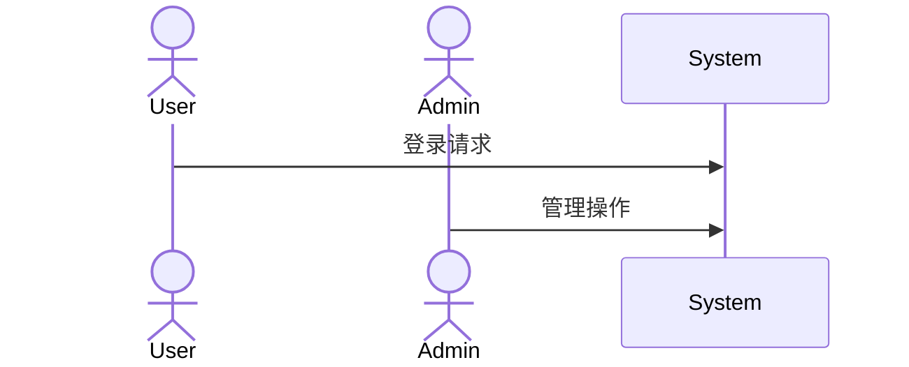
```mermaid
sequenceDiagram
    actor User
    actor Admin
    User->>System: 登录请求
    Admin->>System: 管理操作
```

**要点**：
- 参与者必须位于图的最左侧，这是行业惯例
- 一个时序图中通常只出现1-2个参与者，过多说明用例粒度过大

## 2.2 对象（Object）

对象在时序图顶部以**矩形框**表示，格式为 `对象名:类名`，两者可省略其一。

```
┌─────────────┐  ┌──────────────┐  ┌────────────┐
│  :OrderCtrl │  │ order:Order  │  │    DB       │
└─────────────┘  └──────────────┘  └────────────┘
  匿名对象          具名对象         简写形式
```

**命名规范**：
- `:ClassName` — 匿名对象，表示"该类的任意实例"，最常用
- `objectName:ClassName` — 具名对象，需区分同类的不同实例时使用
- `objectName` — 省略类名，仅在设计早期或类名不明时使用

**排列原则**：
- 发起交互的对象放最左侧
- 消息流向尽量从左到右，减少交叉
- 被动响应的对象放右侧
- 外部系统/数据库放最右

## 2.3 生命线（Lifeline）

生命线是从对象向下延伸的**虚线**，表示对象在时间轴上的存活周期。

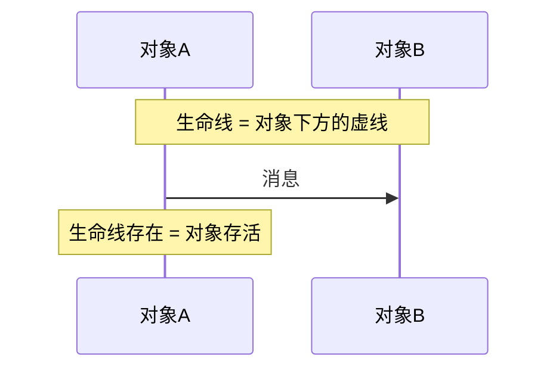
```mermaid
sequenceDiagram
    participant A as 对象A
    participant B as 对象B
    Note over A,B: 生命线 = 对象下方的虚线
    A->>B: 消息
    Note over A: 生命线存在 = 对象存活
```

**关键规则**：
- 对象创建前不存在生命线（通过 `create` 消息创建）
- 对象销毁后生命线终止（通过 `×` 符号标记）

## 2.4 消息（Message）

消息是时序图的核心元素，表示对象间的交互。UML定义了5种消息类型：

### 2.4.1 同步消息（Synchronous Message）

实心箭头 `→`，发送者等待接收者返回后才继续执行。

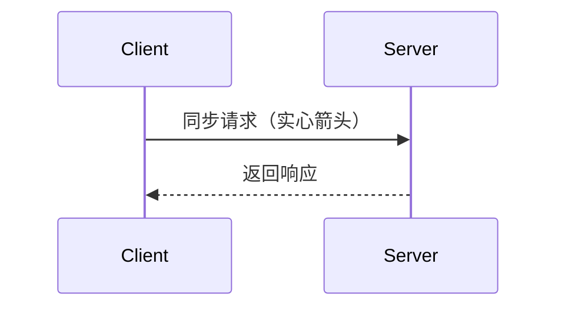
```mermaid
sequenceDiagram
    participant Client
    participant Server
    Client->>Server: 同步请求（实心箭头）
    Server-->>Client: 返回响应
```

### 2.4.2 异步消息（Asynchronous Message）

开放箭头 `⇢`，发送者不等待返回，立即继续执行。

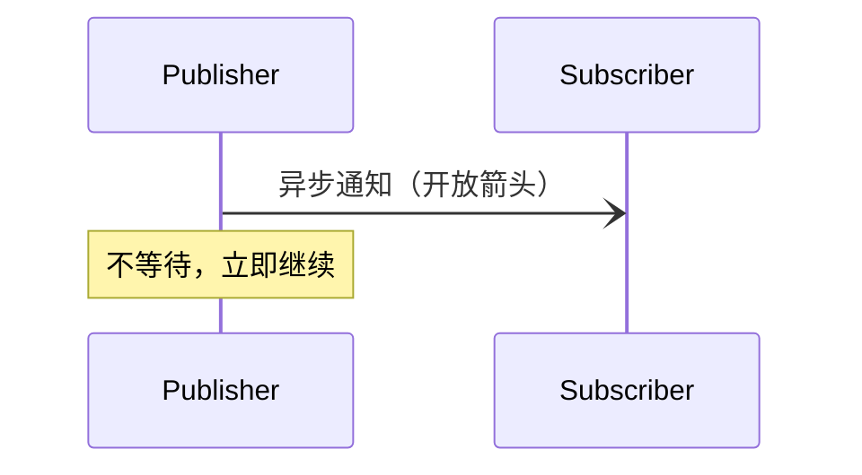
```mermaid
sequenceDiagram
    participant Publisher
    participant Subscriber
    Publisher-)Subscriber: 异步通知（开放箭头）
    Note over Publisher: 不等待，立即继续
```

### 2.4.3 返回消息（Return Message）

虚线箭头 `⇢`，表示同步调用的返回值。

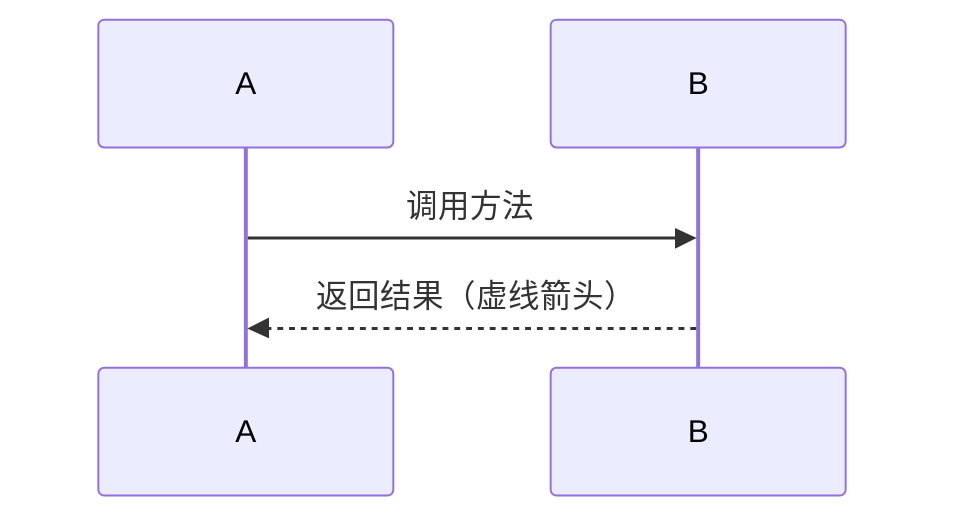
```mermaid
sequenceDiagram
    participant A
    participant B
    A->>B: 调用方法
    B-->>A: 返回结果（虚线箭头）
```

### 2.4.4 自关联消息（Self-Message）

对象发给自己的消息，表示内部处理或递归调用。

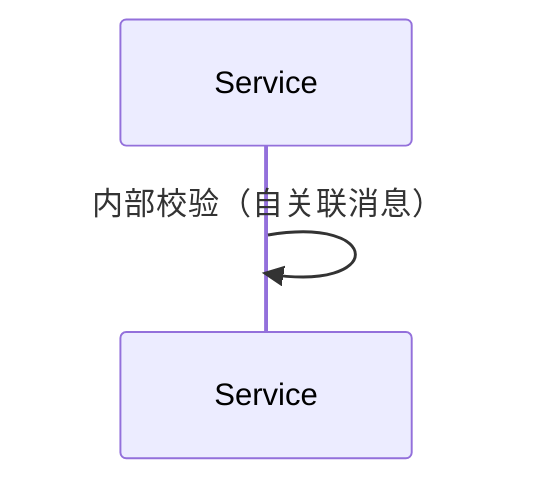
```mermaid
sequenceDiagram
    participant Service
    Service->>Service: 内部校验（自关联消息）
```

### 2.4.5 创建与销毁消息

```mermaid
sequenceDiagram
    participant Client
    participant Thread as :WorkerThread
    Client--)+Thread: «create» 创建
    Thread->>Thread: 执行任务
    Client--x-Thread: «destroy» 销毁
```

### 消息类型速查表

| 类型 | 箭头样式 | 语义 | Mermaid语法 |
|------|----------|------|-------------|
| 同步调用 | 实心实线 → | 等待返回 | `->>` |
| 异步消息 | 开放实线 ⇢ | 不等待 | `->)` 或 `-)` |
| 返回消息 | 开放虚线 ⇢ | 返回结果 | `-->>` |
| 自关联 | 环形箭头 | 内部处理 | `->>` 自身 |
| 创建 | 虚线→ | 实例化 | `--)+` |
| 销毁 | 虚线× | 终止 | `--x` |

## 2.5 激活期（Activation / Execution Specification）

激活期是生命线上的**窄长矩形**，表示对象正在执行某个操作的时间段。

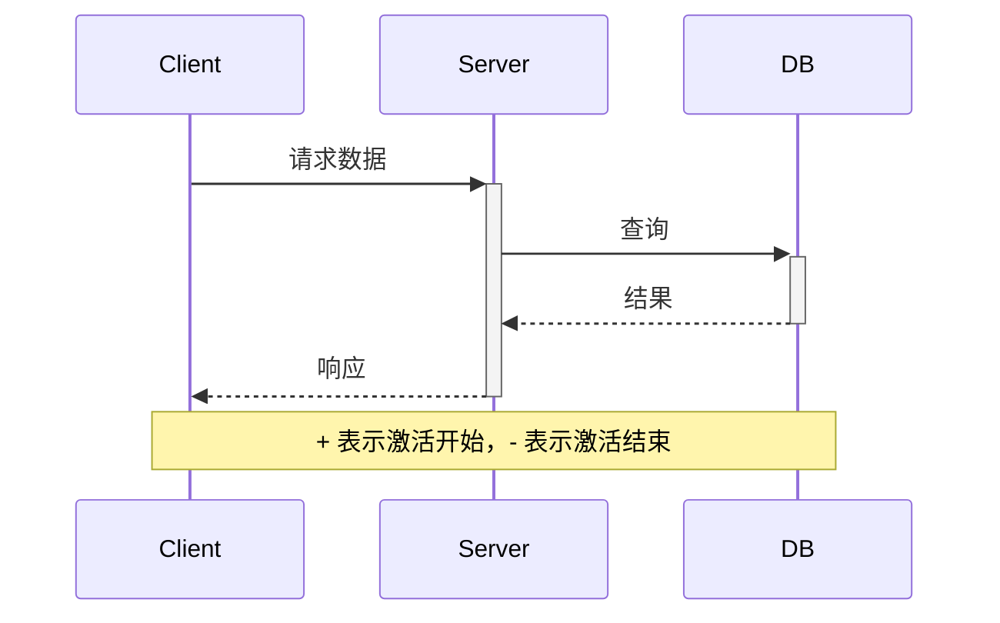
```mermaid
sequenceDiagram
    participant Client
    participant Server
    participant DB
    Client->>+Server: 请求数据
    Server->>+DB: 查询
    DB-->>-Server: 结果
    Server-->>-Client: 响应
    Note over Client,DB: + 表示激活开始，- 表示激活结束
```

**激活期的嵌套**：一个对象在执行过程中调用自身方法，会产生嵌套的激活期矩形。

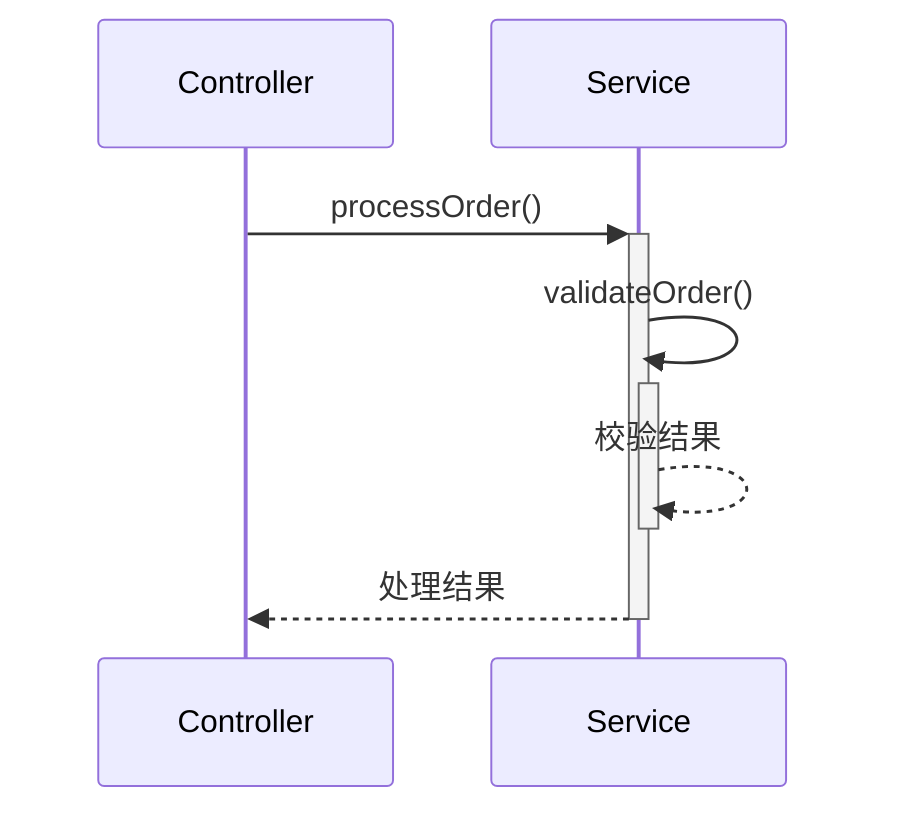
```mermaid
sequenceDiagram
    participant Controller
    participant Service
    Controller->>+Service: processOrder()
    Service->>+Service: validateOrder()
    Service-->>-Service: 校验结果
    Service-->>-Controller: 处理结果
```

## 2.6 组合片段（Combined Fragment）

组合片段用于表达条件逻辑、循环、并发等控制结构，是时序图从"简单交互描述"升级为"精确行为规约"的关键。

### 2.6.1 alt — 条件分支（相当于 if-else）

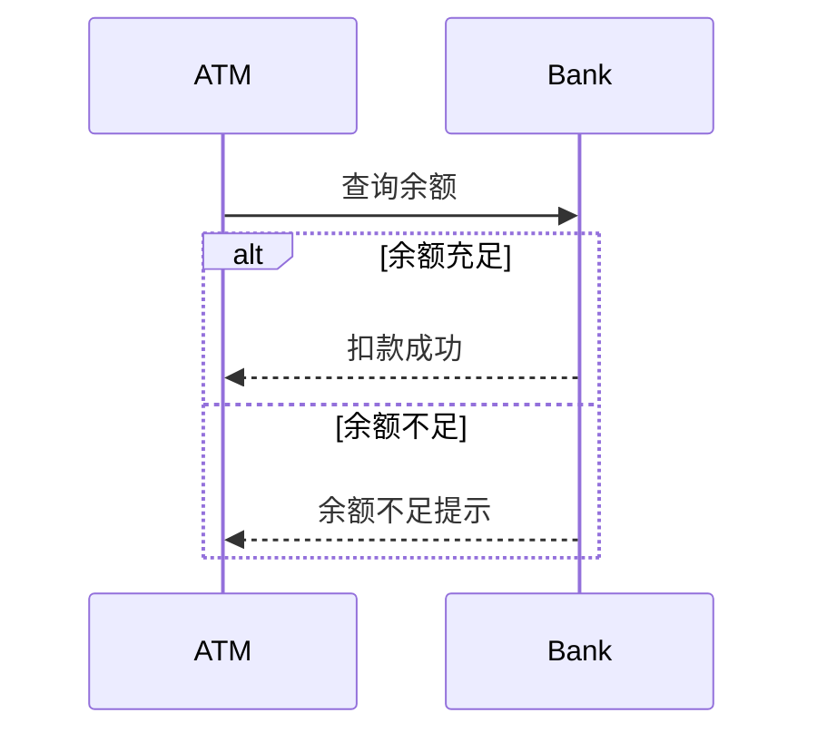
```mermaid
sequenceDiagram
    participant ATM
    participant Bank
    ATM->>Bank: 查询余额
    alt 余额充足
        Bank-->>ATM: 扣款成功
    else 余额不足
        Bank-->>ATM: 余额不足提示
    end
```

### 2.6.2 opt — 可选执行（相当于 if，无 else）

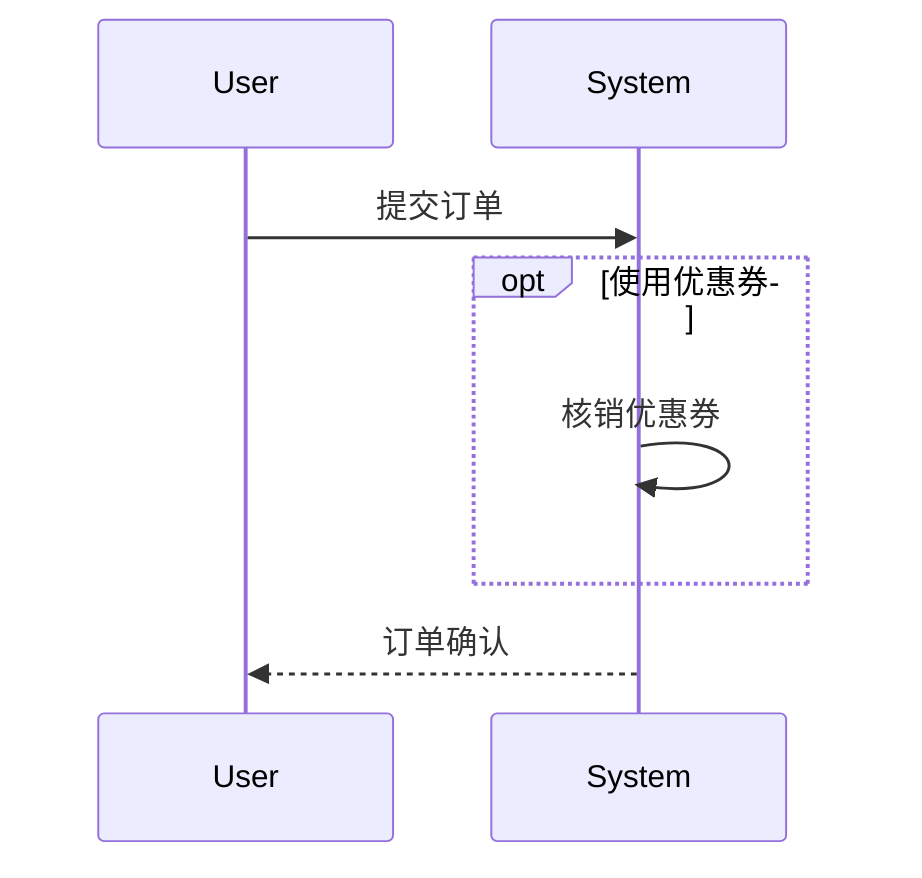
```mermaid
sequenceDiagram
    participant User
    participant System
    User->>System: 提交订单
    opt 使用优惠券
        System->>System: 核销优惠券
    end
    System-->>User: 订单确认
```

### 2.6.3 loop — 循环

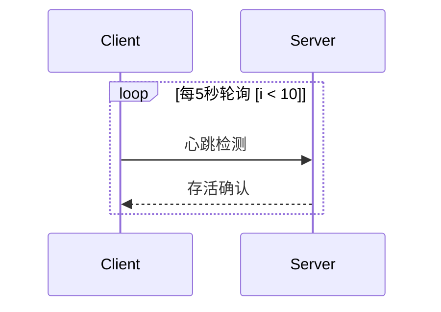
```mermaid
sequenceDiagram
    participant Client
    participant Server
    loop 每5秒轮询 [i < 10]
        Client->>Server: 心跳检测
        Server-->>Client: 存活确认
    end
```

### 2.6.4 par — 并发

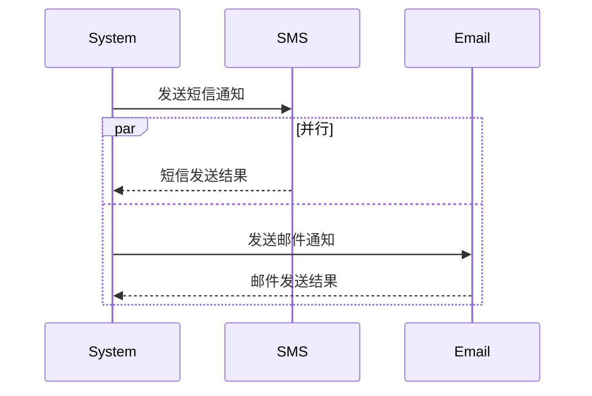
```mermaid
sequenceDiagram
    participant System
    participant SMS
    participant Email
    System->>SMS: 发送短信通知
    par 并行
        SMS-->>System: 短信发送结果
    and
        System->>Email: 发送邮件通知
        Email-->>System: 邮件发送结果
    end
```

### 2.6.5 break — 中断（满足条件时中断当前交互）

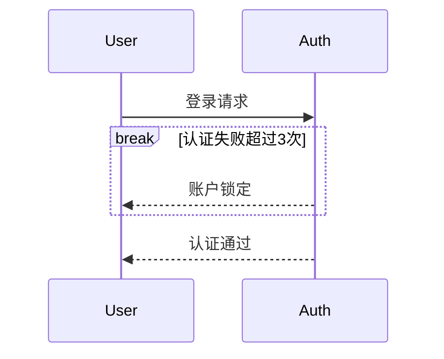
```mermaid
sequenceDiagram
    participant User
    participant Auth
    User->>Auth: 登录请求
    break 认证失败超过3次
        Auth-->>User: 账户锁定
    end
    Auth-->>User: 认证通过
```

### 2.6.6 critical — 原子区域（不可中断）

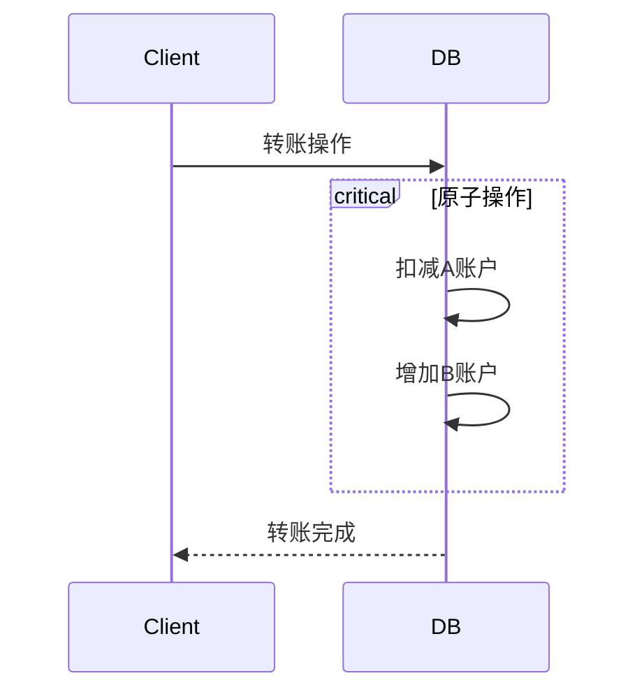
```mermaid
sequenceDiagram
    participant Client
    participant DB
    Client->>DB: 转账操作
    critical 原子操作
        DB->>DB: 扣减A账户
        DB->>DB: 增加B账户
    end
    DB-->>Client: 转账完成
```

### 组合片段速查表

| 操作符      | 语义    | 等价代码               | 分区         |
| -------- | ----- | ------------------ | ---------- |
| alt      | 条件分支  | if-else            | 多个（else分隔） |
| opt      | 可选执行  | if（无else）          | 单个         |
| loop     | 循环    | for/while          | 单个         |
| par      | 并发    | Promise.all / 并行线程 | 多个（and分隔）  |
| break    | 中断    | break / 异常中断       | 单个         |
| critical | 原子区域  | synchronized / 事务  | 单个         |
| ref      | 引用其他图 | 函数调用               | 单个         |

# 三、绘制步骤与方法

## 3.1 从需求到时序图的五步法

```
┌──────────────────────────────────────────────────────────────┐
│  Step 1        Step 2        Step 3       Step 4      Step 5 │
│  识别对象  →  排列对象  →  梳理主流程  →  补充异常  →  精化规范 │
│                                                              │
│  谁？怎么排？  正常路径？  边界情况？  符合标准？              │
└──────────────────────────────────────────────────────────────┘
```

### Step 1：识别参与对象

从用例描述中提取名词，确定参与交互的对象：

1. 识别**参与者**（Actor）：谁发起这个用例？
2. 识别**边界对象**（Boundary）：系统对外的接口层（Controller、API Gateway）
3. 识别**控制对象**（Control）：业务逻辑的协调者（Service、Handler）
4. 识别**实体对象**（Entity）：数据载体与持久化（Model、Repository）

> **经验法则**：一个时序图的对象数量控制在3-7个。超过7个应拆分为子图，用 `ref` 片段引用。

### Step 2：排列对象

按以下原则从左到右排列：

1. **参与者** → 最左侧
2. **边界对象** → 参与者右侧
3. **控制对象** → 中间
4. **实体对象** → 右侧
5. **外部系统/数据库** → 最右侧

### Step 3：梳理主流程（Happy Path）

按时间顺序，从参与者发起的第一个消息开始，逐步添加：

1. 写出每条消息的名称（使用方法签名格式）
2. 标注激活期（谁在执行、谁在等待）
3. 添加返回消息（同步调用必须有返回）

### Step 4：补充异常与变体

1. 用 `alt`/`opt` 处理条件分支
2. 用 `loop` 处理重试/轮询
3. 用 `break` 处理中断场景
4. 用 `par` 处理并发操作

### Step 5：精化与审查

1. 检查每条同步消息是否都有对应的返回
2. 检查激活期是否正确嵌套
3. 检查消息命名是否使用统一的动词或方法签名
4. 检查组合片段的守卫条件是否完整
5. 检查对象排列是否导致消息线大量交叉

## 3.2 完整示例：用户登录流程

### 需求描述

用户通过浏览器登录系统：输入用户名和密码，系统校验参数格式，调用认证服务验证身份，认证成功后生成JWT令牌并返回；认证失败返回错误信息。如果连续失败3次，锁定账户5分钟。

### Step 1：识别对象

| 角色 | 对象 | 类型 |
|------|------|------|
| 用户 | User | Actor |
| 前端 | :LoginController | Boundary |
| 认证服务 | :AuthService | Control |
| 用户仓库 | :UserRepository | Entity |
| 缓存 | :CacheService | Entity |

### Step 2-5：绘制时序图

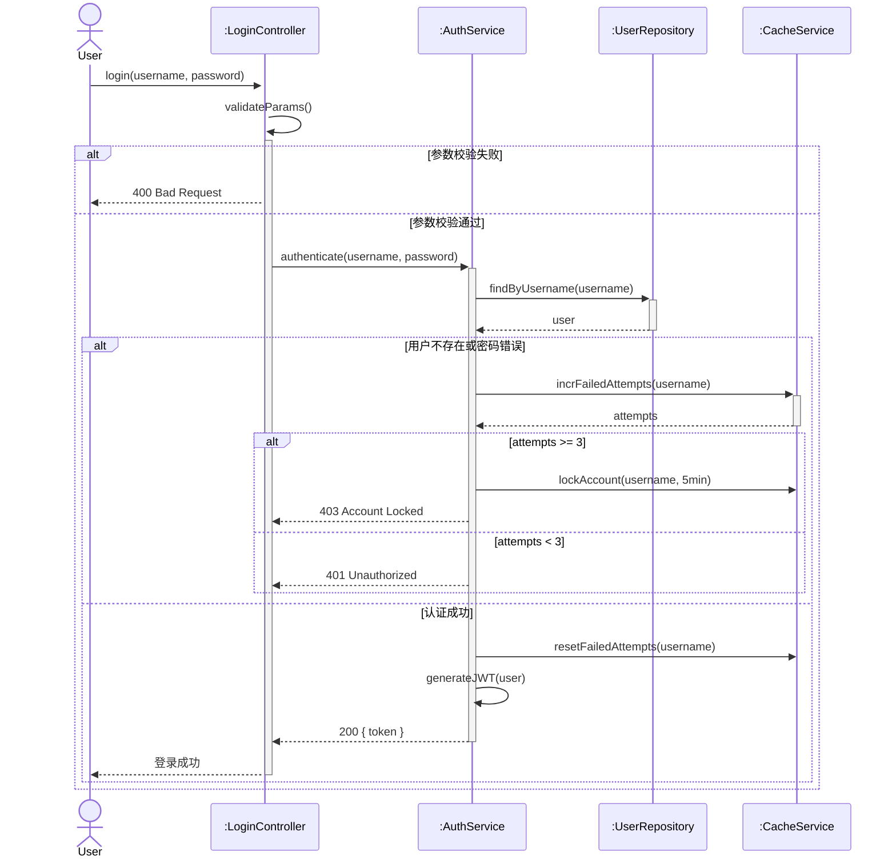
```mermaid
sequenceDiagram
    actor User
    participant LC as :LoginController
    participant AS as :AuthService
    participant UR as :UserRepository
    participant CS as :CacheService

    User->>+LC: login(username, password)
    LC->>+LC: validateParams()

    alt 参数校验失败
        LC-->>User: 400 Bad Request
    else 参数校验通过
        LC->>+AS: authenticate(username, password)
        AS->>+UR: findByUsername(username)
        UR-->>-AS: user

        alt 用户不存在或密码错误
            AS->>+CS: incrFailedAttempts(username)
            CS-->>-AS: attempts
            alt attempts >= 3
                AS->>CS: lockAccount(username, 5min)
                AS-->>LC: 403 Account Locked
            else attempts < 3
                AS-->>LC: 401 Unauthorized
            end
        else 认证成功
            AS->>CS: resetFailedAttempts(username)
            AS->>AS: generateJWT(user)
            AS-->>-LC: 200 { token }
            LC-->>-User: 登录成功
        end
    end
```

### 对应的Mermaid代码


```mermaid
sequenceDiagram
    actor User
    participant LC as :LoginController
    participant AS as :AuthService
    participant UR as :UserRepository
    participant CS as :CacheService

    User->>+LC: login(username, password)
    LC->>+LC: validateParams()

    alt 参数校验失败
        LC-->>User: 400 Bad Request
    else 参数校验通过
        LC->>+AS: authenticate(username, password)
        AS->>+UR: findByUsername(username)
        UR-->>-AS: user

        alt 用户不存在或密码错误
            AS->>+CS: incrFailedAttempts(username)
            CS-->>-AS: attempts
            alt attempts >= 3
                AS->>CS: lockAccount(username, 5min)
                AS-->>LC: 403 Account Locked
            else attempts < 3
                AS-->>LC: 401 Unauthorized
            end
        else 认证成功
            AS->>CS: resetFailedAttempts(username)
            AS->>AS: generateJWT(user)
            AS-->>-LC: 200 { token }
            LC-->>-User: 登录成功
        end
    end
```

# 四、常见错误与避免技巧

## 4.1 结构性错误

### ❌ 错误1：同步消息缺少返回

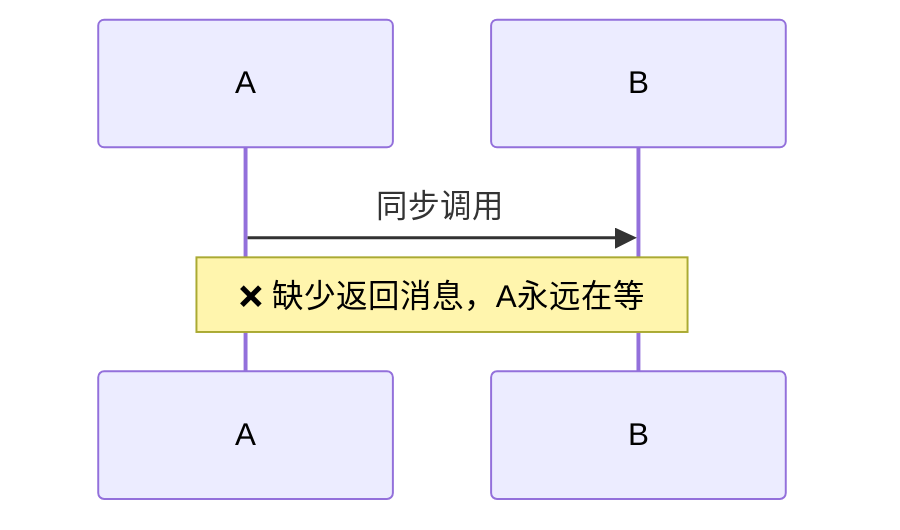
```mermaid
sequenceDiagram
    participant A
    participant B
    A->>B: 同步调用
    Note over A,B: ❌ 缺少返回消息，A永远在等
```

### ✅ 正确做法

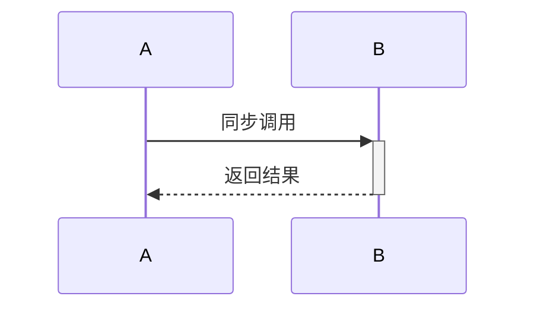
```mermaid
sequenceDiagram
    participant A
    participant B
    A->>+B: 同步调用
    B-->>-A: 返回结果
```

**规则**：每一条同步消息（实心箭头）必须有对应的返回消息（虚线箭头），除非该调用是单向的（应改用异步消息）。

### ❌ 错误2：激活期不匹配

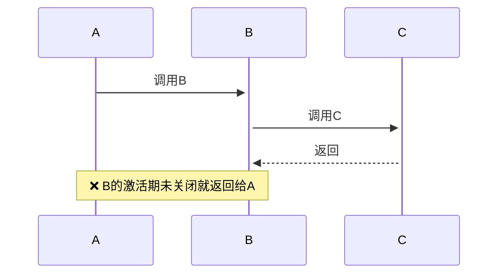
```mermaid
sequenceDiagram
    participant A
    participant B
    participant C
    A->>+B: 调用B
    B->>+C: 调用C
    C-->>B: 返回
    Note over A,B: ❌ B的激活期未关闭就返回给A
```

### ✅ 正确做法

```mermaid
sequenceDiagram
    participant A
    participant B
    participant C
    A->>+B: 调用B
    B->>+C: 调用C
    C-->>-B: 返回
    B-->>-A: 返回
```

**规则**：激活期遵循栈式嵌套——后激活的先关闭（LIFO）。`+` 和 `-` 必须成对出现。

### ❌ 错误3：消息方向混乱

```mermaid
sequenceDiagram
    participant Client
    participant Server
    participant DB
    Client->>Server: 请求
    Server->>DB: 查询
    DB->>Client: 结果
    Note over Client,DB: ❌ DB不应直接返回给Client，跳过了Server
```

### ✅ 正确做法

```mermaid
sequenceDiagram
    participant Client
    participant Server
    participant DB
    Client->>+Server: 请求
    Server->>+DB: 查询
    DB-->>-Server: 结果
    Server-->>-Client: 响应
```

**规则**：消息必须沿调用链逐层返回，不能跳过中间层。

## 4.2 语义性错误

### ❌ 错误4：混淆同步与异步

```mermaid
sequenceDiagram
    participant A
    participant B
    A->>B: 发送邮件通知
    Note over A,B: ❌ 发邮件是典型的异步操作，不应使用同步箭头
```

### ✅ 正确做法

```mermaid
sequenceDiagram
    participant A
    participant B as :EmailService
    A-)B: 发送邮件通知（异步）
    Note over A: 不等待，继续执行
```

**规则**：
- 需要等待结果才能继续 → 同步消息（实心箭头）
- 发出即忘 / 不需要等待 → 异步消息（开放箭头）

### ❌ 错误5：组合片段守卫条件缺失

```mermaid
sequenceDiagram
    participant A
    participant B
    alt
        A->>B: 操作1
    else
        A->>B: 操作2
    end
    Note over A,B: ❌ alt缺少守卫条件，无法判断分支条件
```

### ✅ 正确做法

```mermaid
sequenceDiagram
    participant A
    participant B
    alt [余额 >= 金额]
        A->>B: 扣款
    else [余额 < 金额]
        A->>B: 拒绝交易
    end
```

**规则**：`alt` 的每个分区、`loop` 的循环条件、`opt` 的执行条件、`break` 的中断条件——都必须用方括号 `[ ]` 明确写出守卫条件。

## 4.3 设计性错误

### ❌ 错误6：对象过多，图面混乱

一个时序图包含10+个对象，消息线交叉严重，难以阅读。

### ✅ 正确做法

1. 拆分为多个子时序图，用 `ref` 片段引用
2. 合并职责相近的对象
3. 将内部细节封装为自关联消息

```mermaid
sequenceDiagram
    participant Client
    participant API as :APIGateway
    participant Service as :OrderService

    Client->>+API: 下单请求
    API->>+Service: createOrder()
    Note over Service: ref: 库存校验时序图
    Note over Service: ref: 支付处理时序图
    Service-->>-API: 订单结果
    API-->>-Client: 响应
```

### ❌ 错误7：忽略时间约束

对于实时系统或性能敏感场景，未标注关键消息的时间约束。

### ✅ 正确做法

使用UML的时间约束标注：

```mermaid
sequenceDiagram
    participant Client
    participant Server
    Client->>Server: 请求 {t=0}
    Server-->>Client: 响应 {t<=200ms}
    Note over Client,Server: {t<=200ms} 表示响应时间不超过200ms
```

## 4.4 错误速查清单

| 类别 | 错误 | 检查方法 |
|------|------|----------|
| 结构 | 同步消息无返回 | 每个实心箭头是否有对应虚线返回 |
| 结构 | 激活期未关闭 | `+` 和 `-` 是否成对 |
| 结构 | 消息跳层 | 返回路径是否与调用路径一致 |
| 语义 | 同步异步混用 | 检查每个消息的等待语义 |
| 语义 | 守卫条件缺失 | 每个组合片段是否有 `[条件]` |
| 语义 | 创建/销毁未标注 | 新对象是否用 `«create»`，终止是否用 `×` |
| 设计 | 对象过多 | 是否超过7个对象 |
| 设计 | 消息交叉严重 | 对象排列是否可优化 |
| 设计 | 缺少时间约束 | 关键路径是否有性能标注 |
| 设计 | 粒度不一致 | 消息命名是否在同一抽象层级 |

# 五、实际案例分析

## 5.1 电商下单流程

### 需求描述

用户提交订单后，系统依次执行：库存校验 → 价格计算 → 支付处理 → 订单创建。库存不足时提示缺货；支付失败时回滚库存并提示重试；所有步骤成功后发送通知。

### 时序图

```mermaid
sequenceDiagram
    actor User
    participant OC as :OrderController
    participant OS as :OrderService
    participant IS as :InventoryService
    participant PS as :PaymentService
    participant NS as :NotificationService

    User->>+OC: POST /orders
    OC->>+OS: createOrder(orderDTO)

    OS->>+IS: checkAndReserve(items)
    alt 库存不足
        IS-->>-OS: OutOfStockException
        OS-->>-OC: 409 库存不足
        OC-->>-User: 缺货提示
    else 库存充足
        IS-->>-OS: reserved

        OS->>+PS: processPayment(paymentInfo)
        alt 支付失败
            PS-->>-OS: PaymentFailedException
            OS->>IS: releaseReservation(items)
            OS-->>-OC: 402 支付失败
            OC-->>-User: 支付失败，请重试
        else 支付成功
            PS-->>-OS: paymentConfirmed

            OS->>OS: saveOrder()
            OS->>+NS: sendConfirmation(order)
            NS-->>-OS: sent
            OS-->>-OC: 201 Order Created
            OC-->>-User: 下单成功
        end
    end
```

### 设计要点分析

1. **对象排列**：按调用链从左到右排列，消息流向清晰
2. **异常处理**：两层 `alt` 嵌套，分别处理库存和支付的异常
3. **补偿事务**：支付失败后主动调用 `releaseReservation` 释放库存
4. **异步通知**：通知服务可用异步消息，不阻塞主流程
5. **激活期**：严格标注 `+/-`，清晰表达调用栈的嵌套关系

## 5.2 分布式事务：Saga模式

### 需求描述

跨服务下单采用Saga编排模式：订单服务依次调用库存、支付、物流服务，任一步骤失败则逆向执行补偿操作。

### 时序图

```mermaid
sequenceDiagram
    actor Client
    participant OS as :OrderSaga
    participant IS as :InventoryService
    participant PS as :PaymentService
    participant LS as :LogisticsService

    Client->>+OS: startSaga(order)

    OS->>+IS: reserveStock(items)
    IS-->>-OS: confirmed

    OS->>+PS: chargePayment(payment)
    alt 支付成功
        PS-->>-OS: confirmed

        OS->>+LS: arrangeShipping(order)
        alt 物流安排成功
            LS-->>-OS: confirmed
            OS-->>-Client: Saga 完成
        else 物流安排失败
            LS-->>-OS: failed
            OS->>PS: refundPayment(payment)
            PS-->>OS: refunded
            OS->>IS: releaseStock(items)
            IS-->>OS: released
            OS-->>-Client: Saga 回滚
        end
    else 支付失败
        PS-->>-OS: failed
        OS->>IS: releaseStock(items)
        IS-->>OS: released
        OS-->>-Client: Saga 回滚
    end
```

### 设计要点分析

1. **正向流程**：从左到右依次调用，每步成功才进入下一步
2. **逆向补偿**：失败时按相反顺序执行补偿操作（refund → release）
3. **嵌套层级**：`alt` 嵌套深度反映补偿链的长度，嵌套过深时应考虑拆分
4. **补偿幂等**：补偿操作必须幂等，图中用同一方法名表达

## 5.3 微服务间异步通信

### 需求描述

订单服务通过消息队列与库存、通知服务异步通信：订单创建后发布事件到MQ，库存服务订阅扣减库存，通知服务订阅发送邮件。

### 时序图

```mermaid
sequenceDiagram
    actor User
    participant OS as :OrderService
    participant MQ as :MessageQueue
    participant IS as :InventoryService
    participant NS as :NotificationService

    User->>+OS: 创建订单
    OS->>OS: saveOrder()
    OS-)MQ: OrderCreatedEvent
    OS-->>-User: 订单已创建

    par 异步消费
        MQ-)IS: OrderCreatedEvent
        IS->>IS: deductStock()
    and
        MQ-)NS: OrderCreatedEvent
        NS->>NS: sendEmail()
    end
```

### 设计要点分析

1. **异步消息**：`OrderService` 发布事件后立即返回，不等待消费结果
2. **解耦**：订单服务不直接依赖库存和通知服务，通过MQ间接通信
3. **并发消费**：`par` 片段表达多个消费者并行处理同一事件
4. **最终一致性**：异步模式牺牲强一致性，换取系统可用性和解耦

# 六、最佳实践总结

## 6.1 命名规范

| 元素 | 规范 | 示例 |
|------|------|------|
| 对象 | `:ClassName` 或 `name:ClassName` | `:AuthService` |
| 同步消息 | 方法签名格式 | `authenticate(username, password)` |
| 异步消息 | 事件名格式 | `OrderCreatedEvent` |
| 返回消息 | 返回值或状态码 | `200 { token }` / `user` |
| 守卫条件 | 布尔表达式，方括号包裹 | `[余额 >= 金额]` |

## 6.2 粒度控制

```
┌────────────────────────────────────────────────────────────┐
│  抽象层级      │  适用阶段          │  消息粒度             │
├────────────────┼────────────────────┼──────────────────────┤
│  概念级        │  需求分析          │  业务动作             │
│                │                    │  "提交订单"           │
├────────────────┼────────────────────┼──────────────────────┤
│  逻辑级        │  系统设计          │  接口方法             │
│                │                    │  createOrder(dto)     │
├────────────────┼────────────────────┼──────────────────────┤
│  实现级        │  详细设计          │  具体方法调用         │
│                │                    │  mapper.insert(entity) │
└────────────────┴────────────────────┴──────────────────────┘
```

**原则**：一张图内的消息粒度必须一致。不要在同一个图中混用"提交订单"和 `mapper.insert(entity)`。

## 6.3 绘图工具选择

| 工具 | 适用场景 | 优点 | 缺点 |
|------|----------|------|------|
| Mermaid | 文档内嵌、快速草绘 | 纯文本、版本可控 | 布局自动、不可微调 |
| PlantUML | 正式文档、代码生成 | 语法丰富、生态成熟 | 同为文本、复杂图难调 |
| Draw.io | 自由绘制、演示 | 拖拽灵活、所见即得 | 不可文本化、难版本控制 |
| StarUML | 正式建模、代码工程 | 标准UML、可生成代码 | 学习成本、商业许可 |
| IDEA Plugin | Java项目 | 代码逆向、实时同步 | 仅限Java生态 |

## 6.4 审查清单

绘制完成后，逐项检查：

- [ ] 参与者是否位于最左侧
- [ ] 对象排列是否从左到右、消息流向是否一致
- [ ] 每条同步消息是否有返回
- [ ] 激活期 `+/-` 是否成对
- [ ] 组合片段是否都有守卫条件
- [ ] 异步操作是否使用异步箭头
- [ ] 创建/销毁是否正确标注
- [ ] 消息命名是否在同一抽象层级
- [ ] 对象数量是否 ≤ 7
- [ ] 关键路径是否有时间约束（如需要）
- [ ] 是否与类图/接口定义保持一致
