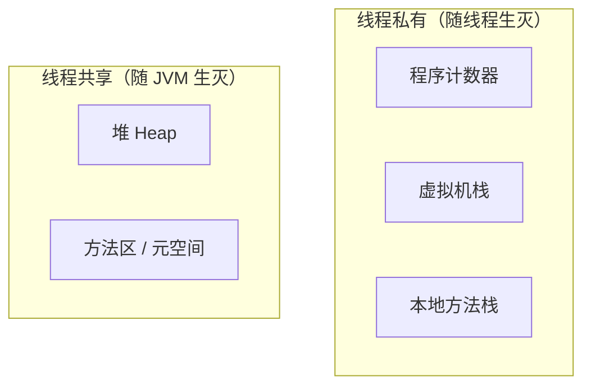

# JVM 内存结构

> JVM 运行时内存分「线程私有」和「线程共享」两大部分；GC 的主战场是**堆**，其次是**方法区（元空间）**。

## 总体结构

## 线程私有区

### 程序计数器（PC Register）
- 记录当前线程执行到哪条字节码指令，是唯一**不会 OOM** 的区域。
- 线程切换后靠它恢复执行位置。

### 虚拟机栈（VM Stack）
- 每个方法对应一个「栈帧」，存局部变量表、操作数栈、动态链接、返回地址。
- 局部变量表存**基本类型和对象引用**（对象本身在堆）。
- 异常：栈深度超限 → `StackOverflowError`；无法扩展 → `OutOfMemoryError`。

### 本地方法栈（Native Method Stack）
- 与虚拟机栈类似，服务于 `native` 方法。

## 线程共享区

### 堆（Heap）—— GC 主战场
- 存放**所有对象实例和数组**。
- 分代结构：新生代（Eden + 两个 Survivor）+ 老年代。
- 异常：`OutOfMemoryError: Java heap space`。

### 方法区（元空间）
- 存放类的元信息、静态变量、运行时常量池、JIT 编译后的代码。
- Java 7 及以前叫「永久代」（堆内），Java 8 起改为「元空间」（本地内存）。
- 详见 [06-方法区与元空间](06-方法区与元空间.md)。

## 为什么需要 GC

对象在堆上分配，用完即弃；如果没有回收，堆会被填满导致 OOM。GC 的核心任务：**找出"已死"的对象并回收其内存**。

## 各区 OOM / 错误一览

| 区域 | 异常 | 典型场景 |
| --- | --- | --- |
| 堆 | `OutOfMemoryError: Java heap space` | 对象创建过多 |
| 虚拟机栈 | `StackOverflowError` | 递归过深 |
| 虚拟机栈 | `OutOfMemoryError` | 线程数过多 |
| 方法区 | `OutOfMemoryError: Metaspace` | 动态生成类过多 |
| 直接内存 | `OutOfMemoryError: Direct buffer memory` | NIO 缓冲区过多 |

> **为什么「线程数过多」会打出栈的 OOM？**
>
> 栈是线程私有的：每创建一个线程，JVM 就要为它分配一块**独立**的栈内存（大小由 `-Xss` 决定，默认 512KB~1MB），且这块内存来自**操作系统进程内存**而非堆。所以栈总占用 = 线程数 × 单线程栈大小——线程开到几千上万个，进程内存被栈吃光，再给新线程分配栈时 OS 拒绝 → `OutOfMemoryError`。
>
> 与 `StackOverflowError` 对比：一个是**纵向**——单线程栈太深（递归过深）；一个是**横向**——线程太多，栈总量叠加超限。
>
> 典型元凶：无界创建线程、`Executors.newCachedThreadPool`（最大线程数 `Integer.MAX_VALUE`）——这也是线程池参数要有界的原因。

> **为什么「动态生成类过多」会撑爆元空间？**
>
> 元空间按「类」记账——每加载一个类就占一块，存类结构、方法字节码、常量池。普通应用启动时加载几千个类后基本不变，不会 OOM。但类的卸载条件极苛刻：该类所有实例已回收 **且** 加载它的 ClassLoader 不可达。由 Bootstrap / 应用类加载器加载的类，ClassLoader 永远活着 → **这些类终身不卸载**。
>
> 而动态生成类（CGLIB 代理、JDK 动态代理、Groovy/JSP 编译、反复 `defineClass`）在运行时还在**持续新增**类对象——业务类是「一次加载终身使用」没问题，动态生成则是「只进不出」，类数量随时间线性增长，涨到 `-XX:MaxMetaspaceSize` 上限就 OOM。
>
> 排查：`jstat -gcmetacapacity` 看元空间是否持续增长不回落；dump 后用 MAT 按 ClassLoader 分组看类数量。
