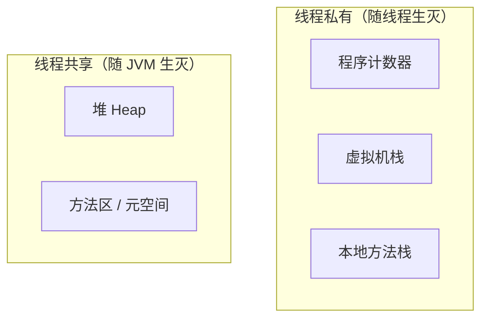

# JVM 内存结构

> JVM 运行时内存分「线程私有」和「线程共享」两大部分；GC 的主战场是**堆**，其次是**方法区（元空间）**。

## 总体结构

## 线程私有区

### 程序计数器（PC Register）
- 记录当前线程执行到哪条字节码指令，是唯一**不会 OOM** 的区域。
- 线程切换后靠它恢复执行位置。

### 虚拟机栈（VM Stack）
- 每个方法对应一个「栈帧」，存局部变量表、操作数栈、动态链接、返回地址。
- 局部变量表存**基本类型和对象引用**（对象本身在堆）。
- 异常：栈深度超限 → `StackOverflowError`；无法扩展 → `OutOfMemoryError`。

### 本地方法栈（Native Method Stack）
- 与虚拟机栈类似，服务于 `native` 方法。

## 线程共享区

### 堆（Heap）—— GC 主战场
- 存放**所有对象实例和数组**。
- 分代结构：新生代（Eden + 两个 Survivor）+ 老年代。
- 异常：`OutOfMemoryError: Java heap space`。

### 方法区（元空间）
- 存放类的元信息、静态变量、运行时常量池、JIT 编译后的代码。
- Java 7 及以前叫「永久代」（堆内），Java 8 起改为「元空间」（本地内存）。
- 详见 [06-方法区与元空间](06-方法区与元空间.md)。

## 为什么需要 GC

对象在堆上分配，用完即弃；如果没有回收，堆会被填满导致 OOM。GC 的核心任务：**找出"已死"的对象并回收其内存**。

## 各区 OOM / 错误一览

| 区域 | 异常 | 典型场景 |
| --- | --- | --- |
| 堆 | `OutOfMemoryError: Java heap space` | 对象创建过多 |
| 虚拟机栈 | `StackOverflowError` | 递归过深 |
| 虚拟机栈 | `OutOfMemoryError` | 线程数过多 |
| 方法区 | `OutOfMemoryError: Metaspace` | 动态生成类过多 |
| 直接内存 | `OutOfMemoryError: Direct buffer memory` | NIO 缓冲区过多 |
