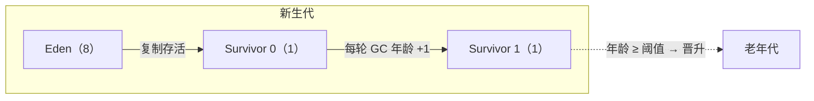

# 分代回收与 GC 类型

> 堆分新生代与老年代；按回收范围，GC 分 Minor / Major / Full / Mixed 四类，触发时机和 STW 各不相同。

## 分代结构
新生代 = Eden + 两个 Survivor（默认 8:1:1）；对象先在 Eden 分配，熬过一定次数 Minor GC 后晋升老年代。

## GC 类型

### Minor GC / Young GC
- 只回收新生代，用标记-复制算法。
- 触发：Eden 满。
- 停顿时间短，但频繁。

### Major GC
- 只回收老年代（等价于老年代 GC），目前只有 CMS 单独回收老年代。

### Full GC
- 回收**整个堆 + 方法区**。
- 触发：老年代满、方法区满、显式 `System.gc()` 等。
- 停顿最长，应尽量避免。

### Mixed GC
- G1 特有，回收新生代 + 部分老年代区域。

## 对象晋升老年代的时机
1. 年龄达到阈值（默认 15，`-XX:MaxTenuringThreshold`）。
2. Survivor 空间不够，大对象直接进老年代（`-XX:PretenureSizeThreshold`）。
3. 动态年龄判定：同龄对象总大小超过 Survivor 一半，直接晋升。

## 触发 Full GC 的常见原因

| 场景 | 说明 |
| --- | --- |
| 老年代空间不足 | 晋升失败 |
| 元空间不足 | 动态类加载过多 |
| 显式调用 `System.gc()` | 不建议 |
| 大对象分配失败 | 直接进老年代却放不下 |
