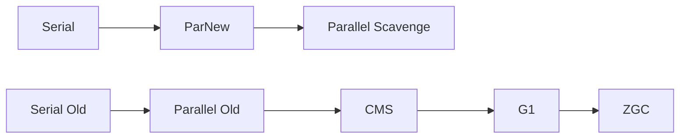

# 垃圾收集器

> 收集器是回收算法的具体实现；按目标分「吞吐优先」和「低延迟」两条线，从 Serial 一路演进到 ZGC。

## 分类总览

- 新生代收集器：Serial、ParNew、Parallel Scavenge
- 老年代收集器：Serial Old、Parallel Old、CMS
- 整堆收集器：G1、ZGC、Shenandoah

## 演进路线

## 各收集器要点

### Serial / Serial Old（单线程）
- 单线程，回收时 STW，适合客户端/小内存场景。

### ParNew
- Serial 的多线程版，新生代并行回收，常配合 CMS。

### Parallel Scavenge / Parallel Old
- **吞吐量优先**，关注"单位时间完成的任务量"，默认用于后台任务型应用。
- 参数：`-XX:MaxGCPauseMillis`（停顿目标）、`-XX:GCTimeRatio`（吞吐量）。

### CMS（Concurrent Mark Sweep，已废弃）
- **低延迟**优先，标记-清除，四个阶段：初始标记（STW）→ 并发标记 → 重新标记（STW）→ 并发清除。
- 缺点：产生碎片、CPU 敏感、无法处理浮动垃圾 → Java 9 起废弃，14 移除。

### G1（默认）
- 把堆划分为等大的 Region，**可预测停顿**（`-XX:MaxGCPauseMillis`）。
- 用「标记-复制」局部回收，Mixed GC 兼顾新生代和部分老年代。
- Java 9 起默认收集器。

### ZGC / Shenandoah
- 超低延迟（目标 < 10ms），用着色指针/读屏障，几乎全程并发，停顿与堆大小无关。

## 如何选择

| 目标 | 推荐 |
| --- | --- |
| 低延迟（响应优先） | G1 / ZGC |
| 高吞吐（批处理） | Parallel Scavenge + Parallel Old |
| 小内存 / 客户端 | Serial |
