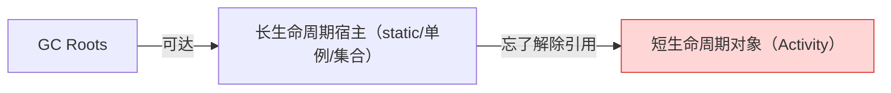

# 内存泄漏

> 定义：无用的对象仍被 GC Roots 间接可达，无法回收，内存被白白占用。终点往往是 OOM。

## 泄漏 vs 溢出
- 泄漏（leak）：对象该回收却没回收 → 是"因"，对象还活着但没用了。
- 溢出（OOM）：可用内存耗尽，申请失败 → 是"果"。

## 泄漏的本质

从 [01-对象存活判定与GC Roots](01-对象存活判定与GC Roots.md) 的角度看：**只要存在一条从 GC Roots 到对象的引用链，对象就永远存活**。所谓泄漏，就是"无用的对象仍被 GC Roots 间接可达"。

引用链模型：



## 排查工具
- LeakCanary（Android）、MAT / JProfiler（JVM）、`jmap`/`jstat` 监控对象增长趋势。
- 核心信号：**内存随使用持续增长且 GC 后不回落**。

## 常见场景

### 场景：单例模式持有 Context

> 套路：**静态单例（应用级）强引用持有 Activity（短生命周期），finish() 后忘了置空 → Activity 无法回收。**

```java
Singleton.getInstance().setContext(activity);   // ① 把 Activity 塞进单例
// onDestroy() 里忘了 setContext(null)  ← ② 泄漏根源：没解除
```

解决：

```java
// 方案1：用完置空
Singleton.getInstance().setContext(null);
// 方案2：使用 Application Context
Singleton.getInstance().init(context.getApplicationContext());
// 方案3：弱引用
private WeakReference<Context> contextRef;
```

详见 [单例模式](../DesignPattern/单例模式.md)。

### 场景：静态集合类

> 套路：**静态集合（应用级）把短生命周期对象 add 进去，用完忘了 remove → 对象永远被集合强引用，无法回收。**

```java
private static List<Activity> activities = new ArrayList<>();  // ① 静态集合
Utils.register(activity);   // ② 塞进去，忘了 remove → 泄漏
```

### 场景：非静态/匿名内部类

> 套路：**匿名/非静态内部类隐式持有 this$0=外部类，且内部类被长生命周期宿主（线程、Handler、单例）持有 → 外部类无法释放。**

```java
new Thread(new Runnable() {
    public void run() { updateUI(); }   // ① 匿名内部类：隐式持有 this$0=Activity
}).start();
// ② 线程活得比 Activity 久 → Activity 无法回收 → 泄漏
```

解决：**静态内部类 + 弱引用**，切断 `this$0`。

```java
static class SafeRunnable implements Runnable {
    private final WeakReference<MyActivity> activityRef;
    SafeRunnable(MyActivity a) { activityRef = new WeakReference<>(a); }
    public void run() {
        MyActivity a = activityRef.get();
        if (a != null) a.updateUI();
    }
}
```

底层机制详见 [09-内部类隐式持有外部类引用](09-内部类隐式持有外部类引用.md)。

### 场景：监听器/回调未注销

> 套路：**全局 EventBus（应用级）用强引用 List 存了监听器（短生命周期），销毁时忘了 unregister → 监听器连同它隐式持有的对象都无法回收。**

```java
listeners.add(listener);   // ① 注册：被 EventBus 强引用
// onDestroy() 里忘了 remove(listener)  ← ② 泄漏根源：没解除
```

解决：改用弱引用容器，或务必在销毁时注销。

```java
private List<WeakReference<Listener>> listeners = new ArrayList<>();
public void register(Listener l) { listeners.add(new WeakReference<>(l)); }
public void post(Event e) {
    listeners.removeIf(ref -> ref.get() == null);  // 清理已回收的
    for (WeakReference<Listener> ref : listeners) {
        Listener l = ref.get();
        if (l != null) l.onEvent(e);
    }
}
```

弱引用原理详见 [02-四种引用类型](02-四种引用类型.md)。

### 场景：资源未关闭

数据库连接、文件流、网络连接未在 `finally` 中关闭，导致缓冲内存无法释放。

```java
// ❌ 泄漏：异常时流不会关闭
public void readFile(String path) throws IOException {
    InputStream is = new FileInputStream(path);
    byte[] data = new byte[1024 * 1024];
    is.read(data);
    is.close();  // 如果 read 抛异常，这行永远执行不到
}
```

```java
// ✅ 正确：try-with-resources（Java 7+），无论是否异常都自动 close()
public void readFile(String path) throws IOException {
    try (InputStream is = new FileInputStream(path)) {
        byte[] data = new byte[1024 * 1024];
        is.read(data);
    }
}
```

数据库连接同理，`Connection`、`Statement`、`ResultSet` 都放进 try-with-resources。

### 场景：系统组件未注销

广播接收器（`BroadcastReceiver`）、服务未及时注销，导致系统资源持续占用。

```java
// ❌ 泄漏：注册了但没注销
private BroadcastReceiver receiver = new BroadcastReceiver() {
    @Override public void onReceive(Context c, Intent i) { updateUI(); }
};
@Override protected void onCreate(Bundle s) {
    super.onCreate(s);
    registerReceiver(receiver, new IntentFilter("ACTION_UPDATE"));
    // onDestroy 里忘了 unregisterReceiver
}
```

```java
// ✅ 正确：onDestroy 中注销
@Override protected void onDestroy() {
    super.onDestroy();
    unregisterReceiver(receiver);
}
```

> 本质也是 [09-内部类隐式持有外部类引用](09-内部类隐式持有外部类引用.md)：匿名 receiver 持有 this$0=Activity，系统全局又持有 receiver → Activity 无法回收。

### 场景：静态变量/成员变量持有大对象

```java
// ❌ 泄漏：静态变量，生命周期 = 应用生命周期
private static byte[] bigData;
public static void init() {
    bigData = new byte[1024 * 1024 * 100];  // 100MB，用完不置空
}
```

```java
// ✅ 正确：用完置空
reportData = null;  // 用完置空，大对象可被 GC 回收
```

判断原则：
- 对象只在单个方法内使用 → 用局部变量，不要存成员变量。
- 需要跨方法共享 → 存成员变量，用完及时置空。
- 需要长期缓存 → 用有界缓存（LRU），设置上限。

### 场景：无限增长的缓存

未设置淘汰策略，无用对象长期占用内存。

```java
// ❌ 泄漏：只 put 不 remove
private Map<Long, User> userCache = new HashMap<>();
```

```java
// ✅ 正确：LinkedHashMap 实现 LRU，超过容量自动淘汰最久未使用
private Map<Long, User> userCache = new LinkedHashMap<Long, User>(100, 0.75f, true) {
    @Override
    protected boolean removeEldestEntry(Map.Entry<Long, User> eldest) {
        return size() > 100;
    }
};
```

### 场景：哈希值变更

对象存入 `HashSet` 后修改参与哈希计算的字段，导致无法从集合中移除。

```java
Set<Person> set = new HashSet<>();
Person p = new Person("张三", 20);
set.add(p);   // 根据 hashCode("张三"+20) 放入桶A
p.age = 30;   // hashCode 变成 ("张三"+30)，对象还在桶A里
set.remove(p); // 用新 hashCode 去桶B找 → 找不到 → 对象无法移除 → 泄漏
```

> 教训：作为 `HashMap`/`HashSet` key 的对象，其 `hashCode()` 依赖的字段应是**不可变**的。

## 通用解决原则
1. 及时释放：在 `finally` 或 `onDestroy()` 中关闭流、注销监听器。
2. 生命周期匹配：避免在单例、静态变量中持有短生命周期对象，优先用局部变量。
3. 弱引用兜底：对"可有可无"的引用改用 [弱引用/软引用](02-四种引用类型.md)。
4. 有界缓存：给缓存设置淘汰策略（LRU），防止无限增长。
5. 工具监控：LeakCanary、Android Profiler、MAT 定位泄漏点。
