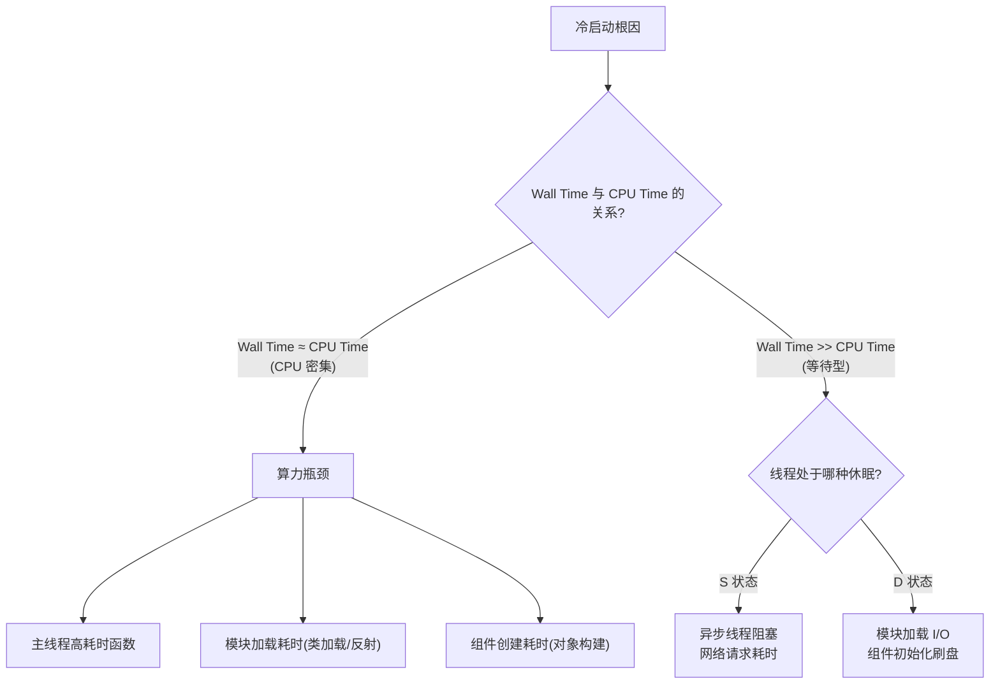
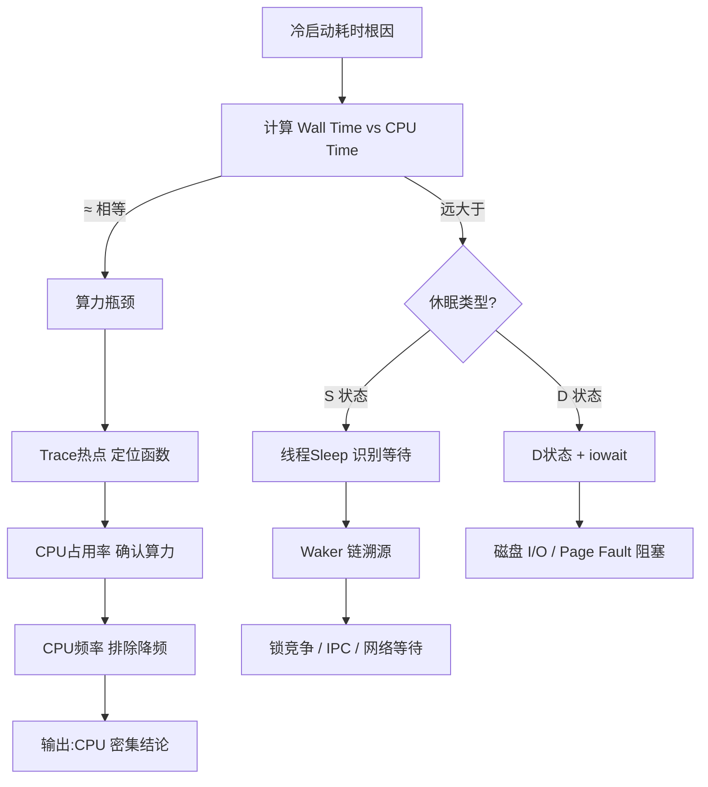

# 冷启动根因 × 指标搭配

SmartPerfetto 的五大指标（**CPU频率、CPU占用率、Trace热点、D状态阻塞、线程Sleep**）不是各自为战，而是一组"证据工具"。针对冷启动的不同根因，SmartPerfetto 按 **「主指标定位 + 辅助指标排除/佐证」** 的方式组合使用，用 Wall Time 三元分解作为统一归因框架。

---

## 1. 统一框架：先用三元分解给根因"定性"

冷启动的五个根因，本质都能落到 Wall Time 三元分解的某个分支上，定性后再选择对应的指标组合：



```text
Wall Time (墙上总时间) = CPU Execution Time (Running) + Runnable Wait + Blocked/Sleep (S / D)
```

**核心结论：根因先被归入「算力瓶颈」或「等待瓶颈」，再决定动用哪组指标。**

---

## 2. 根因 × 指标 映射矩阵

| 冷启动根因 | CPU频率 | CPU占用率 | Trace热点 | D状态 | 线程Sleep |
| --- | :-: | :-: | :-: | :-: | :-: |
| 主线程高耗时函数 | ○ | ● | ● | | |
| 模块加载耗时 | | ● | ● | ○ | |
| 异步线程阻塞 | | ○ | ○ | | ● |
| 网络请求耗时 | | ○ | | | ● |
| 组件创建耗时 | | ● | ● | ○ | |

> **●** = 主指标（定位责任方/定性瓶颈）　**○** = 辅助指标（排除误判 / 佐证上下文）

---

## 3. 逐个根因的指标搭配

### ① 主线程高耗时函数 —— 「算力瓶颈」的典型

- **本质归类：** `Wall Time ≈ CPU Time`，线程长时间处于 `Running` 状态，算法/逻辑本身在吃 CPU。
- **主指标：**
  - **Trace热点：** 下钻火焰图/函数切片，直接锁定 `JSON.parse()`、`Bitmap.decode()`、复杂布局 `onMeasure()` 这类责任函数。
  - **CPU占用率：** 确认该时段占用率接近 100%，坐实"算力瓶颈"而非"等待瓶颈"。
- **辅助指标：**
  - **CPU频率：** 拉取同时段频率曲线，**排除温控降频**（big 核的 compute_supply 骤降）。温控降频时，Trace热点仍会显示"某个函数耗时长"——因为函数确实 Wall Time 变长了，但根因是「在低算力下同样的工作量花了更久」，不是函数逻辑变复杂了。降频是「外部硬件因素」，代码复杂是「软件因素」，诊断时要先排除硬件，再谈代码。

```text
Trace热点定位函数 → CPU占用率确认算力瓶颈 → CPU频率排除降频误判
```

---

### ② 模块加载耗时 —— 「算力 + I/O」的混合型

- **本质归类：** `Wall Time >> CPU Time` 和 `Wall Time ≈ CPU Time` 都可能命中。冷启动阶段 `loadLibrary` / 类加载 / 反射初始化既消耗 CPU，又可能触发读 `.so`、`.dex` 的磁盘 I/O，属于混合型根因。
- **主指标：**
  - **Trace热点：** 确定"耗时长在哪个模块/加载阶段"（如 `System.loadLibrary`、`Class.forName`、第三方 SDK 的 `init`）。
  - **CPU占用率：** 区分该模块加载偏 `CPU 密集`（大量类初始化/反射，Running占比高）还是偏 `I/O 等待`。
- **辅助指标：**
  - **D状态：** 若加载阶段伴随 `D` 状态与 `iowait`，佐证为"读取 so/dex 文件的同步磁盘 I/O"。

```text
Trace热点定位加载阶段 → CPU占用率区分算力/等待 → D状态确认磁盘 I/O
```

---

### ③ 异步线程阻塞 —— 「S 状态」的锁竞争/依赖等待

- **本质归类：** `Wall Time >> CPU Time`，主线程处于可中断休眠 `S` 状态，等某个异步线程的锁或结果。
- **主指标：**
  - **线程Sleep：** 检测主线程在 `S` 状态停留时长。
  - **Waker 链溯源：** 利用 `waker_utid` 向上追踪"谁唤醒了它"。
- **辅助指标：**
  - **CPU占用率：** 极低（< 5%），佐证"非算力瓶颈"。
  - **Trace热点：** 提供"阻塞发生在哪个业务阶段"的锚点（如 `init` 阶段发起了同步 IPC）。

```text
线程Sleep识别等待 → Waker链溯源因果 → 若唤醒者持锁做耗时计算 → 锁竞争；若唤醒者为 Binder 线程 → 跨进程阻塞
```

---

### ④ 网络请求耗时 —— 「S 状态」的 I/O 等待

- **本质归类：** `Wall Time >> CPU Time`，主线程在等 socket 回包（`epoll`/条件变量），是冷启动里最纯粹的等待型根因。
- **主指标：**
  - **线程Sleep：** 主线程长时间处于 `S` 状态，等待网络数据到达。
- **辅助指标：**
  - **CPU占用率：** 趋近于 0，直接排除"算法复杂"的假设，把排查方向锁定到"同步网络请求"。

```text
线程Sleep识别长等待 + CPU占用率≈0 → 定性为网络 I/O 等待 → 结合业务阶段确认「启动期同步请求」
```

---

### ⑤ 组件创建耗时 —— 「算力 + 刷盘」的混合型

- **本质归类：** Activity/Application 组件的反射构建与对象初始化偏 CPU，初始化中读取 `SharedPreferences`、数据库又可能触发刷盘，属于混合型根因。
- **主指标：**
  - **Trace热点：** 定位到具体组件的初始化阶段（`Application#onCreate`、`Activity#onCreate`、`ContentProvider` 初始化）。
  - **CPU占用率：** 区分组件创建中"反射/对象构建"与"磁盘读取"的占比。
- **辅助指标：**
  - **D状态：** 若初始化伴随 `D` 状态与 `ext4_file_write`，佐证为"主线程同步磁盘刷盘"。

```text
Trace热点定位组件初始化 → CPU占用率区分算力/等待 → D状态确认同步刷盘
```

---

## 4. 指标组合决策总览



**SmartPerfetto 的指标搭配原则：**

1. **先定性后选指标** —— 用 `Wall Time vs CPU Time` 把根因归入「算力」或「等待」。
2. **主指标负责定位** —— Trace热点定位"代码责任方"，线程Sleep/D状态定位"阻塞性质"。
3. **辅助指标负责排除** —— CPU频率排除降频，CPU占用率排除算法假设，避免误判。
4. **证据链闭环** —— 单一指标只给线索，多个指标交叉才能给出带数据证据的诊断结论。
