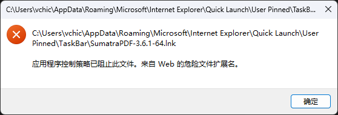

直接解除主程序（或解压文件夹）的 Web 锁定：
1. 找到你解压/存放 SumatraPDF 的实际文件夹（例如 SumatraPDF-3.6.1-64 文件夹，或里面的 SumatraPDF.exe）
2. 右键点击 SumatraPDF.exe 主程序，选择 属性。
3. 查看底部是否有 “安全: 此文件来自其他计算机...” 相关的 解除锁定（Unblock）复选框，勾选它并点击 确定。