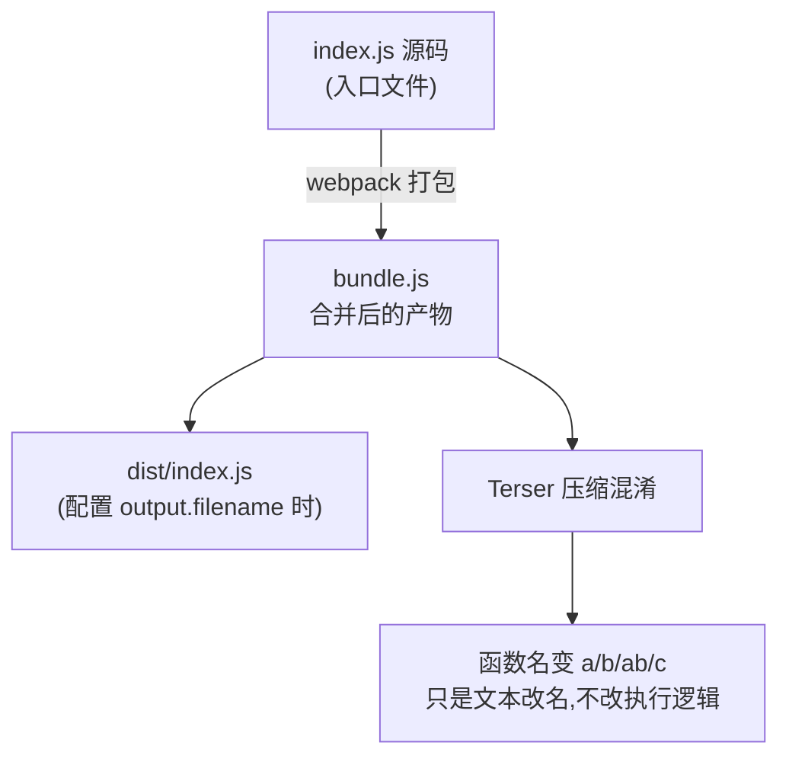
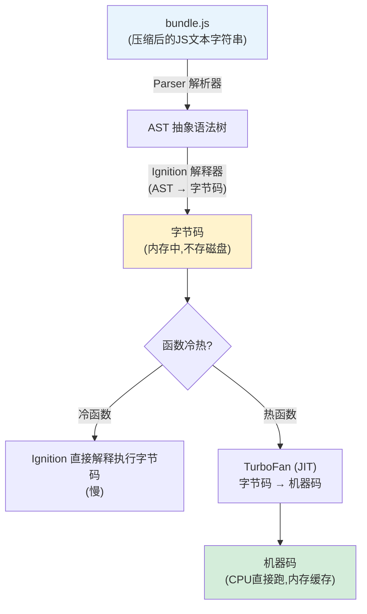
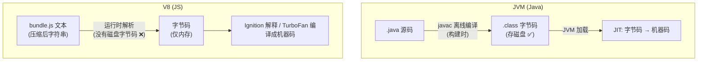
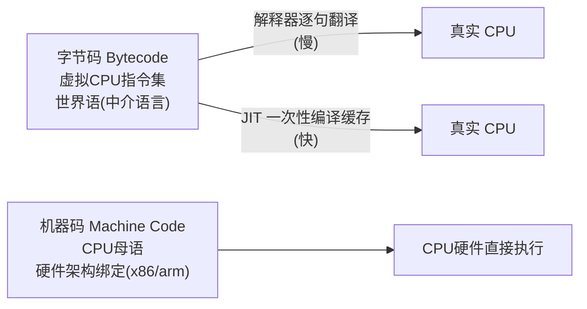
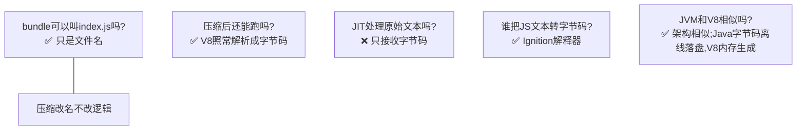
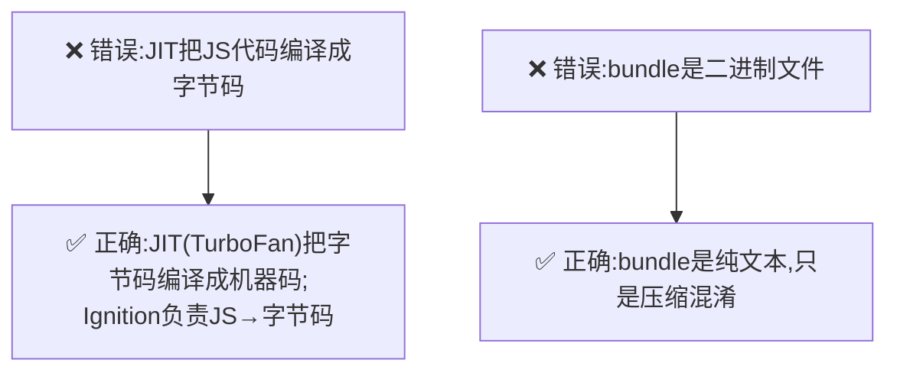
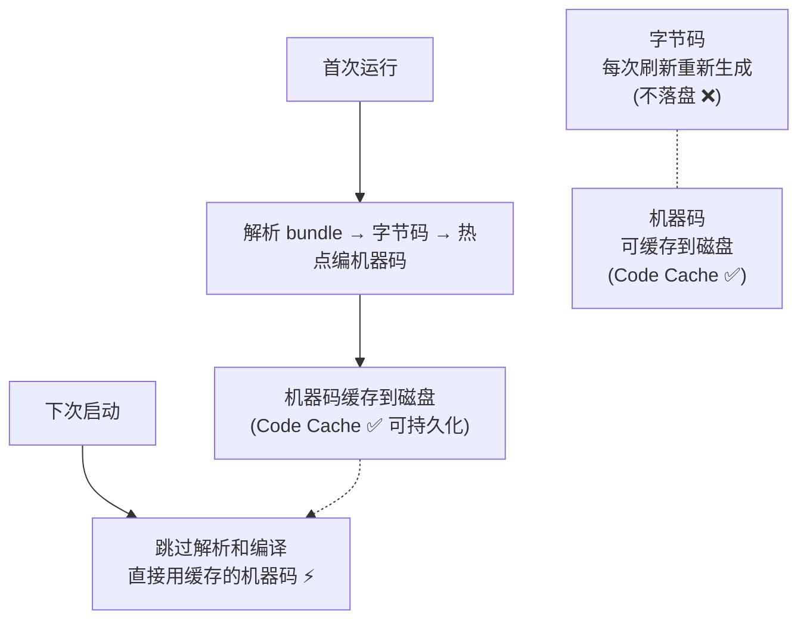

# 逐个梳理，把概念理清楚

## 1、bundle.js 和 index.js 的关系

- `bundle.js`：**webpack打包输出产物的通用名字**，是打包后的合并文件。
- `index.js`：可以是**源码入口文件**，也可以是打包输出文件名（配置output.filename: 'index.js'）。

> 很多项目打包出来就是 `dist/index.js`，这个文件本质就是 bundle。里面函数名变成 `a、b、ab、c`，就是 **Terser 压缩混淆**：把变量、函数名做短名替换，属于**构建阶段文本变换**，不改变逻辑。

***

## 2、V8 的完整执行链路（核心图）

**划重点：**

- **Parser：JS文本 → AST**
- **Ignition：AST → 字节码**
- **TurboFan(JIT)：字节码 → 机器码**

> 🎯 **JIT 不处理原始 JS 文本！JIT只管字节码→机器码**；把JS文本变成字节码的是 Ignition 解释器。

***

## 3、JIT 和 JVM 相似吗？

### 架构对比图

| | JVM (Java) | V8 (JS) |
| --- | --- | --- |
| 共同点 | 都有「字节码中间层」，JIT 负责字节码→机器码 | 同左 |
| 字节码生成时机 | **离线生成**（javac，构建时） | **运行时内存生成** |
| 字节码落盘 | `.class` 存磁盘 | **无磁盘文件** |

> ✅ 有相似的架构思想，但实现完全不一样。

***

## 4、字节码 vs 机器码

- **机器码 = 本地语言（CPU母语）**
- **字节码 = 世界语（中介语言）**
  - 解释器：翻译官，逐句把世界语翻译成本地语言执行（慢）
  - JIT：发现某段世界语反复用，直接一次性编译成本地语言，缓存起来，以后直接跑（快）。

| 项目 | 字节码 | 机器码 |
| --- | --- | --- |
| 执行对象 | 虚拟机/解释器 | 真实CPU硬件 |
| 平台 | 跨平台 | 和CPU架构绑定 |
| 性能 | 较慢（需要翻译） | 最高 |
| V8中 | Ignition输出，内存中 | TurboFan JIT输出 |

***

## 5、回答你一连串疑问汇总

1. bundle.js 可以叫 index.js，只是文件名；里面a/b/ab是混淆压缩的结果，**只是文本改名，不改变执行逻辑**。
2. 压缩后的JS文本，依然会被V8解析，生成字节码，再到机器运行。
3. V8的JIT（TurboFan）**不处理原始JS文本**，只接收字节码，编译为机器码。
4. **把JS文本转为字节码的是 Ignition 解释器**。
5. V8和JVM架构有相似点：都有字节码中间层，JIT做字节码→机器码；但是Java字节码是离线生成磁盘文件，V8字节码是运行时内存生成。

## 面试高频坑点

> ❌ 错误：JIT把JS代码编译成字节码 ✅ 正确：JIT（TurboFan）把**字节码编译成机器码**；**Ignition负责JS→字节码**。

> ❌ 错误：bundle是二进制文件 ✅ 正确：bundle是纯文本，只是压缩混淆。

***

### 补充小知识点：代码缓存（Code Cache）

V8的字节码**不会持久化到磁盘**，每次页面刷新，重新解析bundle重新生成字节码。 只有**机器码会被缓存**（V8的代码缓存，Code Cache），可以把编译后的机器码缓存到磁盘，下次启动跳过解析和编译步骤。
