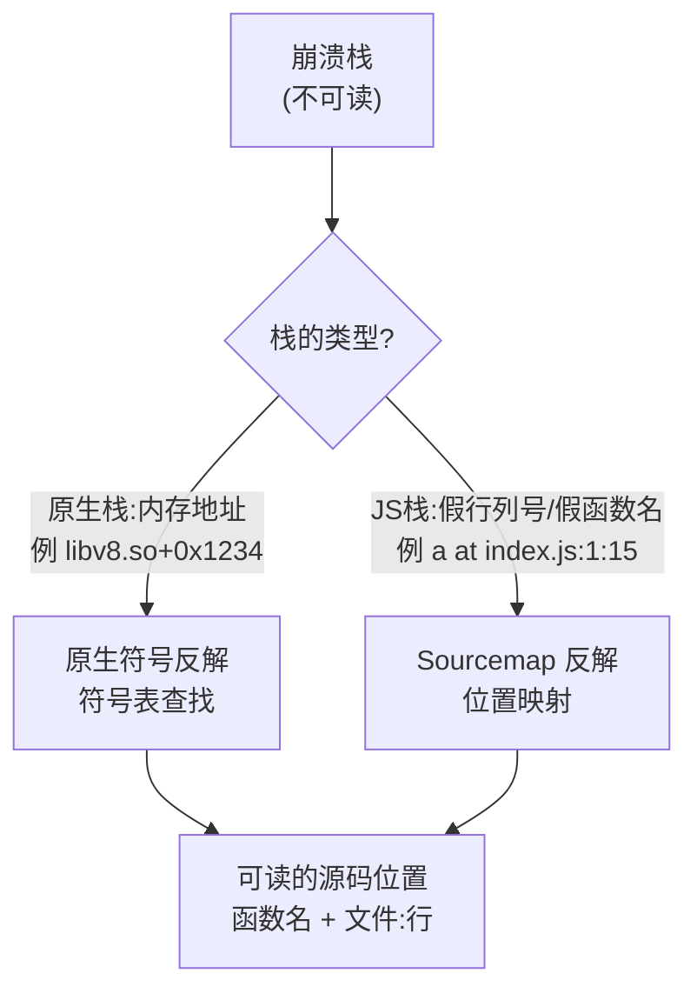
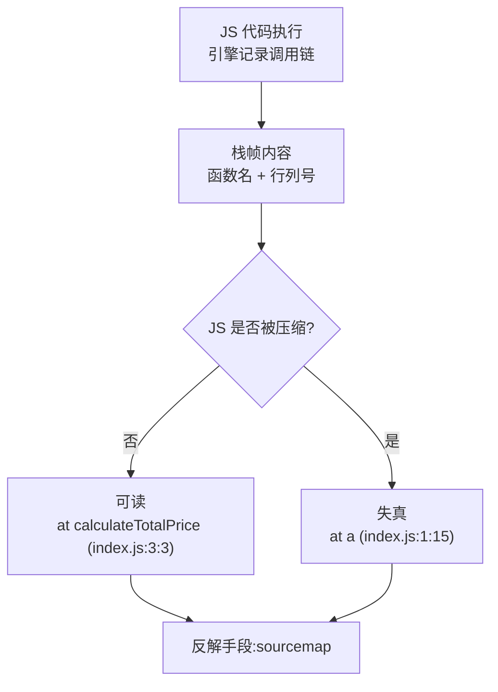
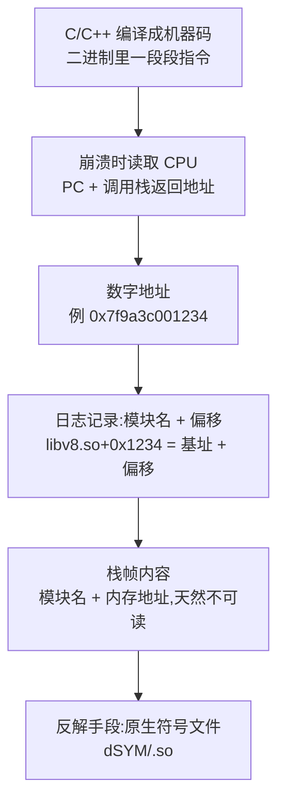
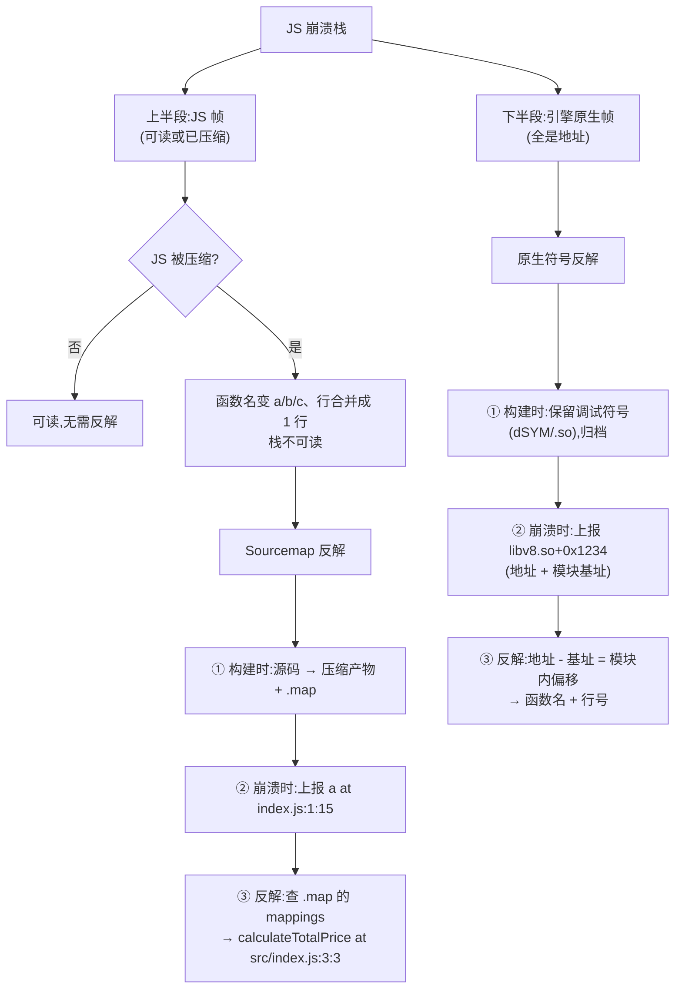
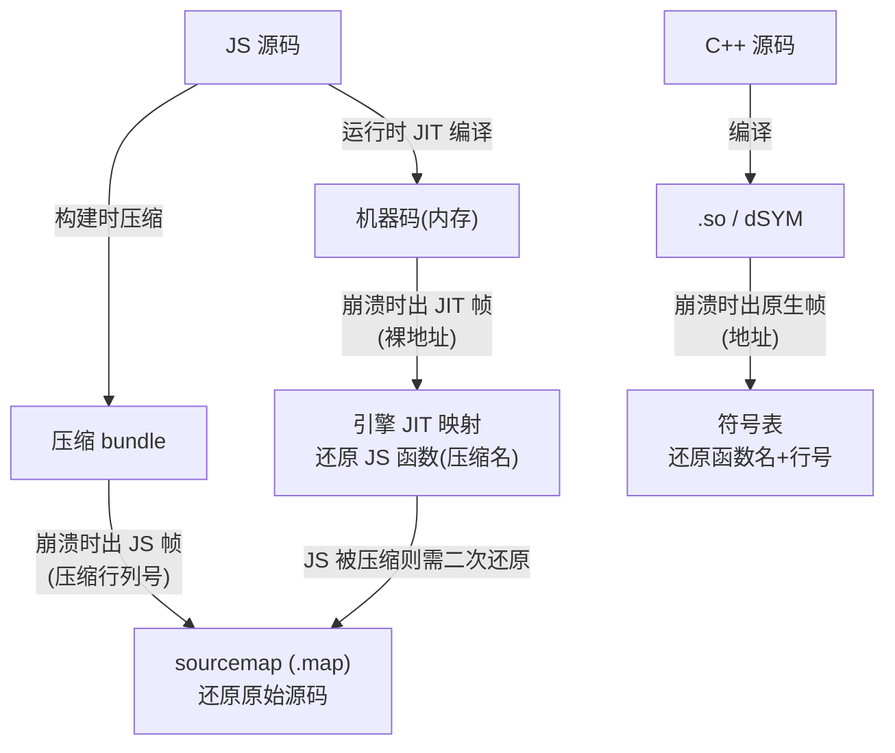
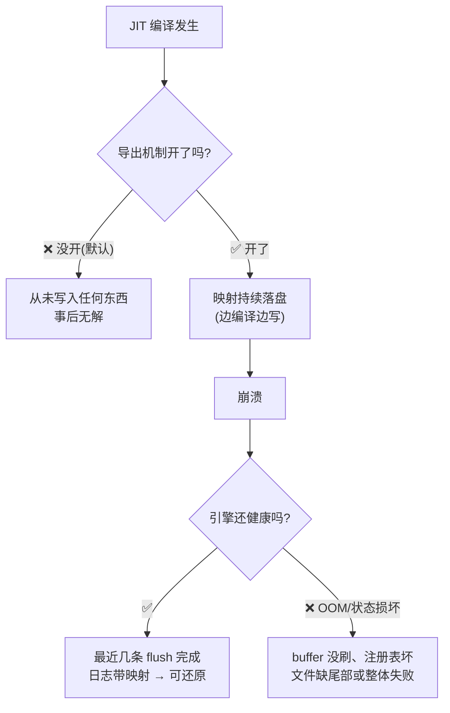

# 反解的本质

崩溃栈里拿到的是"不可读的东西",反解就是把它们还原成可读的源码位置。

两类反解面向完全不同的栈:

# 原生栈 vs JS栈

一个崩溃上报里可能同时包含两种栈:

## JS栈

JS 代码执行时记录的调用链,由 JS 引擎生成:

## 原生栈

C/C++ 编译成机器码，代码就变成了二进制里一段段的指令。崩溃时系统或引擎读取 CPU 的 PC 和调用栈返回地址，得到的是进程地址空间里的数字地址（如 `0x7f9a3c001234`），日志记录为"模块名 + 偏移"（`libv8.so+0x1234` = 基址 + 偏移）：

## 一个崩溃里的两种栈

一个 JS 崩溃栈通常是上半段 JS 帧 + 下半段引擎原生帧。所以崩溃平台通常要求**两类材料都上传**:

- .map → 反解 JS 帧
- dSYM/.so → 反解引擎原生帧

# 场景对比

| 维度     | Sourcemap 反解                  | 原生符号反解                                         |
| ------ | ----------------------------- | ---------------------------------------------- |
| 反解对象   | JS 栈:`a at index.js:1:15`     | 原生栈:`libv8.so+0x1234`                          |
| 对应崩溃类型 | JS 层异常(可捕获/未捕获 Error)         | JS 引擎原生崩溃(堆 OOM、引擎 bug、WASM)                   |
| 材料     | Source Map(.map,JSON)         | dSYM(iOS)/ 带符号 .so(Android)/ Hermes Symbol Map |
| 材料来源   | 构建时自动生成(Metro/Webpack/Terser) | 构建时保留调试符号(不做 strip)                            |
| 材料体积   | 几 KB \~ 几 MB                  | 几十 MB \~ 几百 MB                                 |
| 反解原理   | 文本位置映射(VLQ 编码)                | 二进制符号表查找(DWARF/ELF)                            |
| 必填前提   | 和线上 bundle 同一次构建              | 和线上引擎/App 同一次构建                                |

# 反解完仍可能"不是明文"的部分

即使构建保留了调试符号、完成符号表查找，解析后的栈里仍可能残留不可读帧。如果报错信息的定位恰好依赖这部分,分析就会被卡住。

关键认知:**debug 构建 ≠ 工程里所有 C++ 都是源码形态**。SDK、三方 native 库是预编译的 release 产物，与你的构建配置无关。

另一类不可读来源是 **JIT 生成的代码**:引擎把热 JS 函数即时编译成机器码，放在进程可执行内存里，不进任何 .so 符号表。JIT 映射(机器码地址 ↔ JS 函数)只存在于引擎进程内存中，**崩溃后那份内存就没了**，离线无法重建;除非引擎在崩溃时主动导出映射(如 Hermes symbol map / V8 jitdump)。

- **JS** 被压缩 → 用 **sourcemap** 解

* **JS** 被 JIT 编译（运行时）→ 用 **JIT 映射**解
* **C++** 编成 **.so** → 用 **.so 符号表**解

三层各自独立，一个崩溃栈里三种帧可能同时出现：JS 帧（sourcemap）、JIT 帧（引擎映射）、原生帧（.so 符号）。**JIT 映射和 sourcemap 是两步**：JIT 映射把地址变成"压缩后的 JS 引用"，sourcemap 再把它变成原始源码。

# 静态材料失效的原因

sourcemap/.so 失效共有三个原因：

1. **材料与线上不是同一次构建**（管理问题）：UUID 不匹配，同一枚 .so/.map 但版本错位,换回正确版本就能解
2. **栈里出现了静态材料覆盖不到的帧**（能力边界）：
   - **JIT 帧**：不属于任何二进制文件,需运行时映射
     - `#00 pc 0x0000000000123456 <anonymous:0x7f9a3c000000>` ← 典型 JIT 帧形
     - `#01 pc 0x00000000000abcde libark\_js.so+0x1234` ← 无需事后映射反解帧形
   - **其他二进制的帧**：你的 .so 只含自己代码的符号;SDK/三方预编译库、引擎、系统库是**独立的二进制**,各有自己的符号(或已 strip),要解只能找"那枚库自己的符号文件",厂商不给(release strip)就无解
3. **栈本身残缺**（没有输入可用）:Stack overflow 截断、OOM 无栈等,行列号/地址都没记全,材料再好也白搭

注意:"其他二进制帧"与"版本不匹配"的区别——前者是**结构上就不包含**(再匹配也覆盖不了),后者是**管理问题**(对上版本即可)。

三方库"默认覆盖不了,但取决于对方给不给符号":release strip → 覆盖不了(最常见);碰巧没 strip(开源库 debug 编译)→ 反而能解。

